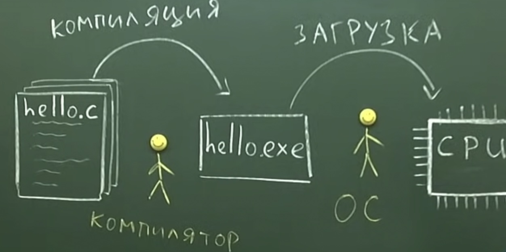
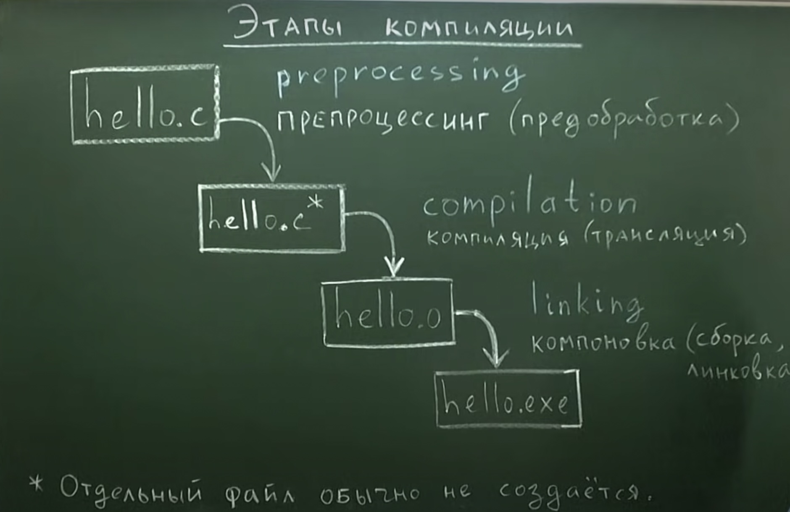
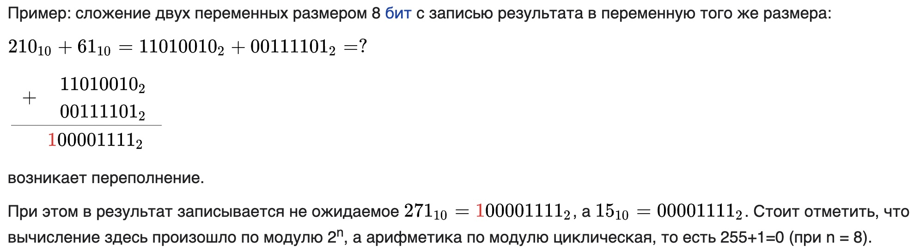
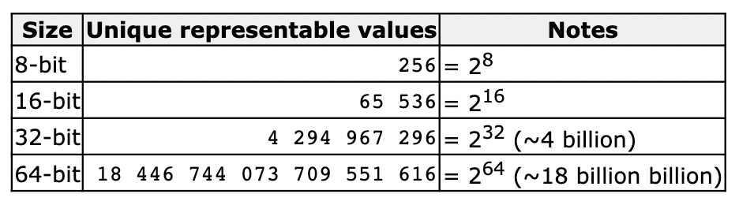
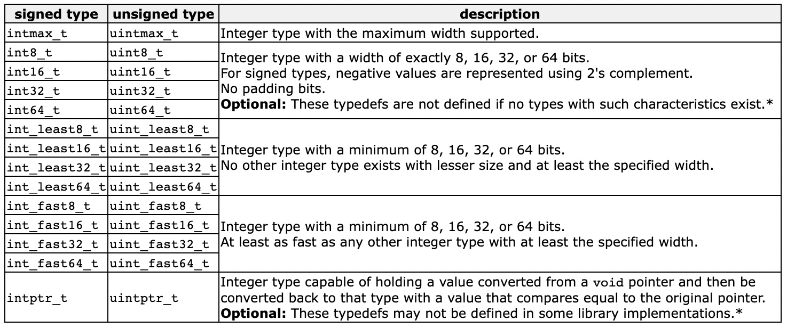
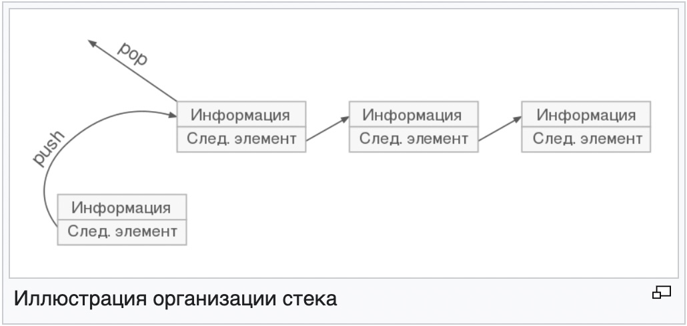
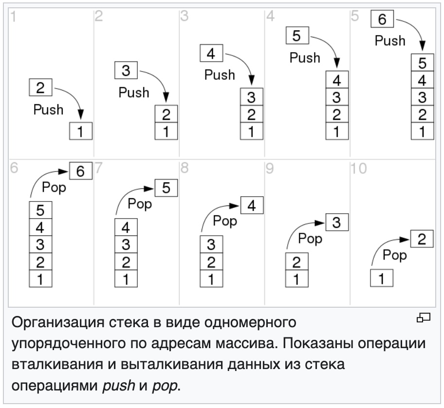

## The C programming Language

Использованные источники:

- **[Second Edition, Brian W. Kernighan, Dennis M. Ritchie](http://cpp.com.ru/kr_cbook/)**

и **[курс по Основам языка Си](http://cs.mipt.ru/c_intro/)** от старшего преподавателя кафедры информатики и вычислительной математики МФТИ **[Тимофей Хирьянов](https://www.youtube.com/channel/UCQfwKTJdCmiA6cXAY0PNRJw)**


## <a id="contents" />Оглавление
[Глава 1. Обзор языка](#chapter1)

[Глава 2. Типы, операторы и выражения](#chapter2)

[Глава 3. Управление](#chapter3)

[Глава 4. Функции и структура программы](#chapter4)

Используемые компиляторы:

- [OnlineGDB](https://www.onlinegdb.com/)

- [Code::Blocks с компилятором MinGW](https://www.codeblocks.org/)

## <a id="chapter1" />Глава 1. Обзор языка

Программа на Си, каких бы размеров она ни была, состоит из *функций и переменных*. Функции содержат *инструкции*, описывающие вычисления, которые необходимо выполнить, а переменные хранят значения, используемые в процессе этих вычислений.

"Hello World" на языке Си

```C
#include <stdio.h>
int main(void) {
  printf("Hello World\n");
  return 0;
}
```
Приведенная программа - это функция с именем `main`. Обычно вы вольны придумывать любые имена для своих функций, но “main" - особое имя: любая программа начинает свои вычисления с первой инструкции функции `main`.

```C
#include <stdio.h>
```
сообщает компилятору, что он должен включить информацию о стандартной библиотеке ввода-вывода. Эта строка встречается в начале многих исходных файлов Си-программ.

***Компилятор*** - это программа преобразующая исходный текст в исполняемый файл, этот процесс называется ***компиляция***

 </img>

Один из способов передачи данных между функциями состоит в том, что функция при обращении к другой функции передает ей список значений, называемых **аргументами**. Этот список берется в скобки и помещается после имени функции. В нашем примере `main` определена как функция, которая не ждет никаких аргументов, что отмечено пустым списком (void).

```C
printf("Hello World\n");
```

Функция `main` вызывает библиотечную функцию `printf` для печати заданной последовательности символов; `\n` - символ новой строки. Символ новой строки никогда не вставляется автоматически.

Функция `printf` - это библиотечная функция, форматированная печать,  которая в данном случае напечатает последовательность символов, заключенную в двойные кавычки.

```C
return 0;
```
Возврат значения, в данном случаи, что функция `main` завершилась удачно и без ошибок

Пример программы диалога

```C
#include <stdio.h>
int main()
{
    printf("I'm a Bot. What's your name?\n");
    char name[20];
    scanf("%s", name);
    printf("Hello, %s! How old are you?\n",name);
    int age;
    scanf("%d", &age);
    printf("You are looking younger! "
           "I thought you are %d!\n", age-3);
    return 0;
}
```
Result

```
make -s
./main
I'm a Bot. What's your name?
Artem
Hello, Artem! How old are you?
27
You are looking younger! I thought you are 24!
```

`scanf()` - функция считывающая форматированный текст с клавиатуры

`%s` - спецификатор формата ожидающий строку
`%d` - спецификатор формата ожидающий целое число

---

### Этапы компиляции на Си: предобработка, трансляция, компоновка

 </img>

hello.c - файл языка С высокого уровня, наш код
hello.o - файл низкого уровня на языке машинных кодов
hello.exe - готовый исполняемый файл

---
### Переменные
***Переменная*** - это именованная ячейка оперативной памяти, которая имеет тип.

RAM (ОЗУ) - оперативно запоминающее устройстро

Переменная жестко сцеплена с конкретной для нее ячейкой памяти

***Тип*** опеределяет:
- жестко задает размер ячейки в байтах
- интерпретацию двоичного кода
- определяет допустимые операции

***Инициализация*** - первичное призваивание переменной значения

В языке Си концепция призваивания это ***копирование***

```C
x = 5;
y = x;
++y;
```

---
---


```C
#include <stdio.h>
/* печать таблицы температур по Фаренгейту
и Цельсию для fahr = 0, 20, ..., 300 */
main()
{
    int fahr, celsius;
    int lower, upper, step;

    lower = 0; /* нижняя граница таблицы температур */
    upper = 300; /* верхняя граница */
    step = 20;  /* шаг */

    fahr = lower;
    while (fahr <= upper) {
        celsius = 5 * (fahr-32) / 9;
        printf(“%d\t%d\n”, fahr, celsius);
        fahr = fahr + step;
    }
}
```
```bash
0	-17
20	-6
40	4
60	15
80	26
100	37
120	48
140	60
160	71
180	82
200	93
220	104
240	115
260	126
280	137
300	148
```

В Си любая переменная должна быть объявлена раньше, чем она будет использована; обычно все переменные объявляются в начале функции перед первой исполняемой инструкцией. В объявлении описываются свойства переменных. Оно состоит из названия типа и списка переменных, например:

```C
int fahr, celsius;
int lower, upper, step;
```
Тип `int` означает, что значения перечисленных переменных есть целые, в отличие от него тип `float` указывает на значения с плавающей точкой, т. е. на числа, которые могут иметь дробную часть.

Числа типа `int` бывают как 16-разрядные (лежат в диапазоне от -32768 до 32767), так и 32-разрядные. Числа типа `float` обычно представляются 32-разрядными словами, имеющими по крайней мере 6 десятичных значащих цифр (лежат приблизительно в диапазоне от 10-38 до 10+38.

Помимо `int` и `float` в Си имеется еще несколько базовых типов для данных, это:

`char` - символ-единичный байт;
`short` - короткое целое;
`long` - длинное целое;
`double` - с плавающей точкой с двойной точностью.

| Тип |	Определение |	Диапазон значений |	Размер в байтах |
| :---------: | :---------- | :---------- | :---------: |
|int |	Целые числа |	-2 147 483 648 до 2 147 483 647	|  4|
|short int |	Короткие целые числа | -32 768 до 32 767	|  2|
|float |  Дробные числа (числа с плавающей запятой)	| -2 147 483 648.0 до 2 147 483 647.0	| 4 (32 bit) |
|double |	Дробные числа двойной точности	| -9 223 372 036 854 775 808 .0 до 9 223 372 036 854 775 807.0 | 8|
|long float |	Длинные дробные числа (зависит от системы) |	-9 223 372 036 854 775 808 .0 до 9 223 372 036 854 775 807.0 | 8|
|char | Символы | ‘Q’; ‘f’; ‘:’; ‘@’ | 1|
|string | Строковые данные | строки, которые можно закодировать в 32 разрядах или меньше | 4|
|bool | Булевы выражения | true; false | 1|

Программа выполняет вычисления по формуле `°С = (5/9)(°F-32`) и печатает таблицу соответствия температур по Фаренгейту температурам по Цельсию

```
celsius = 5 * (fahr-32) / 9;
```
Причина, по которой мы сначала умножаем на 5 и затем делим на 9, а не сразу умножаем на 5/9, связана с тем, что в Си, как и во многих других языках, деление целых сопровождается **отбрасыванием**, т. е. потерей дробной части. Так как 5 и 9 - целые, отбрасывание в 5/9 дало бы нуль, и на месте температур по Цельсию были бы напечатаны нули.

**Функция printf** - это универсальная функция форматного ввода-вывода. Ее первый аргумент - строка символов, в которой каждый символ `%` соответствует одному из последующих аргументов (второму, третьему, ...), а информация, расположенная за символом `%`, указывает на вид, в котором выводится каждый из этих аргументов. Например, `%d` специфицирует выдачу аргумента в виде целого десятичного числа, и инструкция

```C
printf(“%d\t%d\n”, fahr, celsius);
```
печатает целое `fahr`, выполняет табуляцию `(\t)` и печатает целое `celsius`.

В функции `printf` каждому спецификатору первого аргумента (конструкции, начинающейся с `%`) соответствует второй аргумент, третий аргумент и т. д. Спецификаторы и соответствующие им аргументы должны быть согласованы по количеству и типам: в противном случае напечатано будет не то, что нужно.
[Подробнее о `printf` и спецификаторах](https://cplusplus.com/reference/cstdio/printf/)

 </img>

Например, 0°F на самом деле (с точностью до десятой) равно -17.8°С, а не -17. Чтобы получить более точные значения температур, нам надо пользоваться не целочисленной арифметикой, а арифметикой с плавающей точкой.

```C
#include <stdio.h>
/* печать таблицы температур по Фаренгейту и Цельсию для fahr = 0, 20, . .., 300; вариант с плавающей точкой   */
main()
{
    float fahr, celsius;
    int lower, upper, step;

    lower = 0;   /* нижняя граница таблицы температур */ 
    upper = 300; /* верхняя граница */ 
    step = 20;   /* шаг */

    fahr = lower;
    while (fahr <= upper) { 
        celsius = (5.0/9.0) * (fahr-32.0);
        printf(“%3.0f %6.1f\n”, fahr, celsius);
        fahr = fahr + step;
    }
}
```

`printf(“%3.0f %6.1f\n”, fahr, celsius);`
Спецификация *%3.0f* в `printf` определяет печать числа с плавающей точкой (в данном случае числа `fahr`) в поле шириной не более трех позиций без десятичной точки и дробной части. Спецификация `%6.1f` описывает печать другого числа (`celsius`) в поле из шести позиций с одной цифрой после десятичной точки

```bash
  0  -17.8
 20   -6.7
 40    4.4
 60   15.6
 80   26.7
100   37.8
120   48.9
140   60.0
160   71.1
180   82.2
200   93.3
220  104.4
240  115.6
260  126.7
280  137.8
300  148.9
```

Спецификаторы формата ожидающие определенный тип
`%d`	- печать десятичного целого.
`%6d`	- печать десятичного целого в поле из шести позиций.
`%f`	- печать числа с плавающей точкой.
`%6f` - печать числа с плавающей точкой в поле из шести позиций.
`%.2f`	- печать числа с плавающей точкой с двумя цифрами после десятичной точки.
`%6.2f`	- печать числа с плавающей точкой и двумя цифрами после десятичной точки в поле из шести позиций.
Кроме того, printf допускает следующие спецификаторы: `%o` для восьмеричного числа; `%x` для шестнадцатеричного числа; `%c` для символа; `%s` для строки символов и `%%` для самого %.

Упражнение 1.4. Напишите программу, которая будет печатать таблицу соответствия температур по Цельсию температурам по Фаренгейту.

```C
#include <stdio.h>
main()
{
    float fahr, celsius;
    int lower, upper, step;

    lower = 0;   /* нижняя граница таблицы температур */ 
    upper = 300; /* верхняя граница */ 
    step = 20;   /* шаг */

    celsius = lower;
          printf("Таблица\n");
    while (celsius <= upper) { 
        fahr = (9.0 * celsius) / 5.0 + 32.0;
        printf("%3.0f %6.0f\n", celsius, fahr);
        celsius = celsius + step;
    }
}
```
```bash
Таблица 
  0     32
 20     68
 40    104
 60    140
 80    176
100    212
120    248
140    284
160    320
180    356
200    392
220    428
240    464
260    500
280    536
300    572
```

---
## Overflow and underflow
### Переполнение и ошибки при работе с целыми типами в Си

 </img>

```C
#include <stdio.h>
#include <inttypes.h>

int main(int argc, char* argv[])
{
    int8_t x = 127;
    printf("x = %d\n", x);
    x += 1;
    printf("Overflow, x = %d\n", x);
    x -= 1;
    printf("Underflow, x = %d\n", x);
    x *= 2;
    printf("x = %d\n", x);
    return 0;
}
```

Result:
```bash
x = 127
Overflow, x = -128
Underflow, x = 127
x = -2

```

[Целочисленное переполнение](https://ru.wikipedia.org/wiki/%D0%A6%D0%B5%D0%BB%D0%BE%D1%87%D0%B8%D1%81%D0%BB%D0%B5%D0%BD%D0%BD%D0%BE%D0%B5_%D0%BF%D0%B5%D1%80%D0%B5%D0%BF%D0%BE%D0%BB%D0%BD%D0%B5%D0%BD%D0%B8%D0%B5)

***Целочи́сленное переполне́ние*** (англ. integer overflow) — ситуация в компьютерной арифметике, при которой вычисленное в результате операции значение не может быть помещено в n-битный целочисленный тип данных. Различают переполнение через верхнюю границу представления и через нижнюю (англ. Underflow).

 </img>

---
## [Variables and types](https://www.cplusplus.com/doc/tutorial/variables/)

Значения переменных хранятся где-то в неуказанном месте в памяти компьютера в виде нулей и единиц. Нашей программе не нужно знать точное местоположение, в котором хранится переменная; она может просто ссылаться на нее по ее имени. О чем программа должна знать, так это о типе данных, хранящихся в переменной. Хранить простое целое число - это не то же самое, что хранить букву или большое число с плавающей запятой; несмотря на то, что все они представлены с использованием нулей и единиц, они интерпретируются по-разному, и во многих случаях они не занимают одинаковый объем памяти.

Основные типы данных - это базовые типы, реализуемые непосредственно языком, которые представляют основные единицы хранения, изначально поддерживаемые большинством систем. В основном их можно разделить на:

- ***Character types***: Они могут представлять один символ, например 'A' или '$'. Самым базовым типом является `char`, который представляет собой однобайтовый символ.

- ***Numerical integer types***: Они могут хранить целочисленное значение, например 7 или 1024. Они существуют в различных размерах и могут быть подписаны или неподписаны, в зависимости от того, поддерживают ли они отрицательные значения или нет.

- ***Floating-point types***: Они могут представлять реальные значения, такие как 3,14 или 0,01, с различными уровнями точности, в зависимости от того, какой из трех типов с плавающей запятой используется.

- ***Boolean type***: The boolean type, known in C/C++ as bool, can only represent one of two states, true or false.

 </img>

Имена определенных целочисленных типов могут быть сокращены без их компонентов `signed` и `int` - для идентификации типа требуется только часть, не выделенная курсивом, часть, выделенная курсивом, необязательна. Т.е. `signed short int` может быть сокращен как `signed short`, `short int` или просто `short`; все они идентифицируют тот же фундаментальный тип. `int` всегда знаковый по умолчанию

Внутри каждой из вышеперечисленных групп разница между типами заключается только в их размере (т.Е. в том, сколько они занимают в памяти): первый тип в каждой группе является самым маленьким, а последний - самым большим, причем каждый тип по крайней мере такой же большой, как и предыдущий в той же группе. Кроме этого, типы в группе имеют одинаковые свойства.

Обратите внимание на панели выше, что, кроме char (размер которого составляет ровно один байт), ни один из основных типов не имеет указанного стандартного размера (но не более минимального размера). Следовательно, для типа не требуется (и во многих случаях не требуется) именно этот минимальный размер. Это не означает, что эти типы имеют неопределенный размер, но что ***не существует стандартного размера для всех компиляторов и машин***; *каждая реализация компилятора может указывать размеры для этих типов*, которые наилучшим образом соответствуют архитектуре, на которой будет выполняться программа. Эта довольно общая спецификация размера для типов дает языку C/C++ большую гибкость, которую можно адаптировать для оптимальной работы на всех типах платформ, как нынешних, так и будущих.

Размеры типов, указанные выше, выражены в битах; чем больше битов имеет тип, тем более четкие значения он может представлять, но в то же время также потребляет больше места в памяти:

 </img>

Для целочисленных типов наличие большего количества представимых значений означает, что диапазон значений, которые они могут представлять, больше; например, 16-разрядное целое число без знака сможет представлять 65536 различных значений в диапазоне от 0 до 65535, в то время как его аналог со знаком сможет представлять в большинстве случаев значения между -32768 и 32767. Обратите внимание, что диапазон положительных значений примерно вдвое меньше в типах со знаком по сравнению с типами без знака, из-за того, что один из 16 битов используется для знака; это относительно скромная разница в диапазоне, и она редко оправдывает использование неподписанных типов, основанных исключительно на диапазоне положительных значений, которые они могут представлять.

Для типов с плавающей запятой размер влияет на их точность, поскольку для их значащего и экспоненты используется больше или меньше битов.

Если размер или точность типа не вызывают беспокойства, то `char`, `int` и `double` обычно выбираются для представления символов, целых чисел и значений с плавающей запятой соответственно. Другие типы в их соответствующих группах используются только в очень особых случаях.

Символьный `char` содержит число на самом деле.

```C
#include <stdio.h>

// библиотека для значений bool
#include <stdbool.h>

// библиотека для int с конкретными кратными байтовыми значениями по типу int8, int16, int32, int64
#include <inttypes.h>

int main(int argc, char* argv[])
{
    char c;
    int i;
    
    int8_t i8;
    int16_t i16;
    int32_t i32;
    int64_t i64;
    
    double d;
    bool b;

    int64_t i64;

    return 0;
}
```
[Библиотека cstdint/stdint.h](http://cplusplus.com/reference/cstdint/)
 </img>

#### Явное и неявное приведение типов
```C
#include <stdio.h>

int main(int argc, char* argv[])
{
    // int is implicitly cast to unsigned int
    /* Если типы не соответствуют друг другу, 
    то происходит неявное автоматическое приведение типов на выходе при каждой арифметической операции */
    int x = -100;
    unsigned int y = 10U;
    long long int z = x + y;
    printf("z = %lld\n", z);

    // char is explicitly (явное) cast to int
    char c = 'Я';
    int d = (int)c * 10;
    printf("d = %d\n", d);

    return 0;
}
```

---
### Инструкция for
Видоизменим нашу программу преобразования температур:

```C
#include <stdio.h>
/* печать таблицы температур по Фаренгейту и Цельсию */
main()
{
    int fahr;
    for (fahr = 0; fahr <= 300; fahr = fahr + 20)
        printf("%3d %6.1f\n", fahr, (5.0/9.0)*(fahr-32));
}
```
Выражение, вычисляющее температуру по Цельсию, теперь задано третьим аргументом функции `printf`, а не в отдельной инструкции присваивания.

Последнее изменение является примером применения общего правила: **в любом контексте, где возможно использовать значение переменной какого-то типа, можно использовать более сложное выражение того же типа**. Так, на месте третьего аргумента функции `printf` согласно спецификатору `%6.1f` должно быть значение с плавающей точкой, следовательно, здесь может быть любое выражение этого типа.

---
### Именованные константы
Строка `#define` определяет символьное имя, или именованную константу, для заданной строки символов:

```c
#define имя подставляемый-текст
```
С этого момента при любом появлении имени оно будет заменяться на соответствующий ему подставляемый-текст.

```C
#include <stdio.h>

#define LOWER 0   /* нижняя граница таблицы */
#define UPPER 300 /* верхняя граница */
#define STEP 20   /* размер шага */

/* печать таблицы температур по Фаренгейту и Цельсию */
main()
{
    int fahr;
    for (fahr = LOWER; fahr <= UPPER; fahr = fahr + STEP)
        printf(“%3d %6.1f\n”, fahr, (5.0/9.0)*(fahr-32));
}
```

LOWER, UPPER и STEP - именованные константы, а не переменные, поэтому для них нет объявлений. По общепринятому соглашению имена именованных констант набираются заглавными буквами, чтобы они отличались от обычных переменных, набираемых строчными. Заметим, что в конце `#define-строки` точка с запятой не ставится.

---
### `getchar` и `putchar
Стандартная библиотека включает несколько функций для чтения и записи одного символа. Простейшие из них - `getchar` и `putchar`. За одно обращение к `getchar` считывается следующий символ ввода из текстового потока, и этот символ выдается в качестве результата. Так, после выполнения

```C
c = getchar();
```
переменная `c` содержит очередной символ ввода. Обычно символы поступают с клавиатуры. 

Обращение к `putchar` приводит к печати одного символа. 

```C
putchar(c);
```
напечатает содержимое целой переменной `c` в виде символа (обычно на экране). Вызовы `putchar` и `printf` могут произвольным образом перемежаться. Вывод будет формироваться в том же порядке, что и обращения к этим функциям.

---
### Копирование файла
Программа, копирующая по одному символу с входного потока в выходной поток:

```C
    чтение символа
        while (символ не является признаком конца файла)
    вывод только что прочитанного символа
    чтение символа
```

```C
#include <stdio.h>
/* копирование ввода на вывод, 1-я версия */
main()
{
    int c;
    c = getchar();
    while (c != EOF) {
        putchar(c);
        c = getchar();
    }
}
```
Оператор отношения `!=` означает “не равно”

Каждый символ, вводимый с клавиатуры или появляющийся на экране, как и любой другой символ внутри машины, кодируется комбинацией битов. Тип `char` специально предназначен для хранения символьных данных, однако для этого также годится и любой целый тип. Мы пользуемся типом `int` и делаем это по одной важной причине, которая требует разъяснений.

Существует проблема: как отличить конец ввода от обычных читаемых данных. Решение заключается в том, чтобы функция getchar по исчерпании входного потока выдавала в качестве результата такое значение, которое нельзя было бы спутать ни `с` одним реальным символом. Это значение есть **EOF (аббревиатура от end of file - конец файла)**. Мы должны объявить переменную `c` такого типа, чтобы его “хватило” для представления всех возможных результатов, выдаваемых функцией `getchar`. Нам не подходит тип `char`, так как c должна быть достаточно “емкой”, чтобы помимо любого значения типа `char` быть в состоянии хранить и EOF. Вот почему мы используем `int`, а не `char`.

EOF - целая константа, определенная в `<stdio.h>`. Какое значение имеет эта константа - неважно, лишь бы оно отличалось от любого из возможных значений типа `char`. Использование именованной константы с унифицированным именем гарантирует, что программа не будет зависеть от конкретного числового значения, которое, возможно, в других Си-системах будет иным.

Цикл `while`, пересылая в `c` полученное от `getchar` значение, сразу же проверяет: не является ли оно “концом файла”. Если это не так, выполняется тело цикла `while` и печатается символ. По окончании ввода завершается работа цикла `while`, а тем самым и `main`.

---
### Подсчет символов
```C
#include <stdio.h>
/* подсчет вводимых символов; 1-я версия */ 
main()
{
    long nc;
    nc = 0;
    while (getchar() != EOF) {
        ++nc;
    printf(“%ld\n”, nc);
    }
}
```
Инструкция `++nc;` представляет новый оператор ` ++ `, который означает увеличить на единицу. Вместо этого можно было бы написать `nc=nc+1`, но ++nc короче, а часто и эффективнее. Существует аналогичный оператор ` -- `, означающий уменьшить на единицу. Операторы ` ++ ` и ` -- ` могут быть как префиксными `(++nc)`, так и постфиксными `(nc++)`. 

Программа подсчета символов накапливает сумму в переменной типа `long`. Целые типа long имеют не менее 32 битов. Хотя на некоторых машинах типы `int` и `long` имеют одинаковый размер, существуют, однако, машины, в которых `int` занимает 16 бит с максимально возможным значением 32767, а это - сравнительно маленькое число, и счетчик типа `int` может переполниться. Спецификация `%ld` в `printf` указывает, что соответствующий аргумент имеет тип `long`.

Возможно охватить еще больший диапазон значений, если использовать тип `double` (т. е. `float` с двойной точностью). Применим также инструкцию `for` вместо `while`, чтобы продемонстрировать другой способ написания цикла.

```C
#include <stdio.h>
/* подсчет вводимых символов; 2-й версия */
main()
{
    double nc;
    for (nc = 0; getchar() != EOF; ++nc) {
        ;
    printf(“%.0f\n”, nc);
    }
}
```
В `printf` спецификатор `%f` применяется как для `float`, так и для `double`; спецификатор `%.0f` означает печать без десятичной точки и дробной части (последняя в нашем случае отсутствует).

Тело указанного for-цикла пусто, поскольку кроме проверок и приращений счетчика делать ничего не нужно. Но правила грамматики Си требуют, чтобы for-цикл имел тело. Выполнение этого требования обеспечивает изолированная точка с запятой, называемая пустой инструкцией. 

---
### Подсчет строк
```C
#include <stdio.h>
/* подсчет строк входного потока */
main()
{
    int c, nl;
    nl = 0;
    while ((c = getchar()) != EOF){
        if (c == '\n')
            ++nl;
    printf(“%d\n”, nl);
    }
}
```
Тело цикла теперь образует инструкция `if`, под контролем которой находится увеличение счетчика `nl` на единицу. Инструкция `if` проверяет условие в скобках и, если оно истинно, выполняет следующую за ним инструкцию.

---
### Подсчет слов
Программа подсчитывает строки, слова и символы, причем под словом здесь имеется в виду любая строка символов, не содержащая в себе пробелов, табуляций и символов новой строки. Эта программа является упрощенной версией программы `wc` системы UNIX.

```bash
flyboroda@MacBook-Air-Artem ~ % cd Documents/MyGit/CS50MyNotes 
flyboroda@MacBook-Air-Artem CS50MyNotes % wc README.md 
     526    3291   35240 README.md
```
Программa выведет три числа, обозначающих количество строк, слов и байт введённой информации.

```C
#include <stdio.h>

#define IN 1	/* внутри слова */
#define OUT 0	/* вне слова */
/* подсчет строк, слов и символов */
main()
{
    int с, nl, nw, nc, state;
    state = OUT;
    nl = nw = nc = 0;
    while ((с = getchar()) != EOF) {
        ++nc;
        if (c == '\n')
            ++nl;
        if (c == ' ' || c == '\n' || c == '\t')
            state = OUT;
        else if (state == OUT) {
            state = IN;
            ++nw;
        }
    }
    printf(“%d %d %d\n”, nl, nw, nc);
}
```

Каждый раз, встречая первый символ слова, программа изменяет значение счетчика слов на 1. Переменная `state` фиксирует текущее состояние - находимся мы внутри или вне слова. Вначале ей присваивается значение `OUT`, что соответствует состоянию “вне слова”. Мы предпочитаем пользоваться именованными константами `IN` и `OUT`, а не собственно значениями 1 и 0, чтобы сделать программу более понятной.

Упражнение 1.12. Напишите программу, которая печатает содержимое своего ввода, помещая по одному слову на каждой строке.
```C
#include <stdio.h>
#define IN 1 //внутри слова
#define OUT 0 //вне слова

int main()
{
 int c, state;
 state = OUT;
 while ((c = getchar()) != EOF) {
  if ( c == ' ' || c == '\t' || c == '\n') {
   state = OUT;
  }
  else if (state == OUT) {
   putchar('\n');
   state = IN;
  }
  putchar(c);
 }
 return 0;
}
```
```
My name is Artem
My 
name 
is 
Artem
```

---
### Массивы
А теперь напишем программу, подсчитывающую по отдельности каждую цифру, символы-разделители (пробелы, табуляции и новые-строки) и все другие символы. Имеется двенадцать категорий вводимых символов. Удобно все десять счетчиков цифр хранить в массиве, а не в виде десяти отдельных переменных. Вот один из вариантов этой программы:

```C
#include <stdio.h>

/* подсчет цифр, символов-разделителей и прочих символов */
int main()
{
    int c, i, nwhite, nother;
    int ndigit[10];

    nwhite = nother = 0;
    for (i = 0; i < 10; ++i) {
        ndigit[i]= 0;
    }

    while ((c = getchar()) != EOF) {
        if (c >='0' && c <= '9') {
            ++ndigit[c - '0'];
        }
        else if (c == ' ' || c == '\n' || c == '\t') {
            ++nwhite;
        }
        else {
            ++nother;
        }
    }

    printf("цифры =");
    for (i = 0; i < 10; ++i) {
        printf("%d", ndigit[i]);
    }
    printf(", символы-разделители =%d, прочие =%d\n", nwhite, nother);
}
```
```bash
The C programming Language
цифры =0000000000, символы-разделители =4, прочие =23
```

Объявление `int ndigit[10];` - объявляет `ndigit` массивом из 10 значений типа `int`. В Си элементы массива всегда нумеруются начиная с нуля, так что элементами этого массива будут `ndigit[0], ndigit[1], ..., ndigit[9]`, что учитывается в for-циклах (при инициализации и печати массива).

По определению, значения типа `char` являются просто малыми целыми, так что переменные и константы типа `char` в арифметических выражениях идентичны значениям типа `int`. Это и естественно, и удобно; например, `c-'0'` есть целое выражение с возможными значениями от 0 до 9, которые соответствуют символам от '0' до '9', хранящимся в переменной `c`. Таким образом, значение данного выражения является правильным индексом для массива `ndigit`.


Упражнение 1.13. Напишите программу, печатающую гистограммы длин вводимых слов. Гистограмму легко рисовать горизонтальными полосами. 

```C
#include <stdio.h>
#define IN 1
#define OUT 0
/*печатает гистограммы длин вводимых слов*/
 
int main()
{
int c, state;
state = OUT;
 
while ((c = getchar()) != EOF)
{
    if (c != ' ' && c != '\n' && c != '\t')
    {
        state = IN;
        putchar('-');
    }
    else if (state == IN)
    {
        state = OUT;
        putchar('\n');
    }
}
    return 0;
}
```
Inputs: `The C programming Language Brian W. Kernighan, Dennis M. Ritchie`
Result:
```bash
---
-
-----------
--------
-----
--
----------
------
--
-------
```

---
or another decision 
```C
#include <stdio.h>
/*подсчет символов в словах и печатание горизонтальной гистограммы с количеством символов*/
#define IN 1 /*внутри слова*/
#define OUT 2 /*вне слова*/
 
int main()
{
int c, nc, state;
nc = 0; state = OUT;
 
while ((c = getchar()) != EOF) {
    if (c != ' ' && c != '\n' && c != '\t')
        {state = IN;++nc; /*когда внутри слова-вклячается счетчик символов*/
        putchar('-'); } /*печатаем горизонтальную гистограмму этого слова*/
    else if (state == IN){
        state = OUT; printf("%d",nc); /*когда слово закончилось-печатаем количество символов в этом слове*/
        putchar('\n'); nc = 0;} /*переходим на новую строку и обнуляем счетчик символов, иначе он будет печатать общее количество символов всех слов*/
}
    return 0;
}
```
Inputs: `The C programming Language Brian W. Kernighan, Dennis M. Ritchie`
Result:
```bash
---3
-1
-----------11
--------8
-----5
--2
----------10
------6
--2
-------7

```

----
or another decision 
```C
#include <stdio.h>
main()
{
        int c;
        while ((c=getchar()) != EOF) {
                if (c == ' ' || c == '\n' || c == '\t')
                        printf("\n");
                else
                        printf("_");
        }
}
```

Inputs: `The C programming Language Brian W. Kernighan, Dennis M. Ritchie`
Result:
```bash
___
_
___________
________
_____
__
__________
______
__
_______
```

---
Рисование вертикальными полосами - более трудная задача.

```C
#include <stdio.h>
/*программа печатающая вертикальную гистограмму вводимых символов в словах*/
#define IN 1 /*внутри слова*/
#define OUT 0/*вне слова*/
#define MAXWORDS 80 /*максимальное количество слов в нашей гистограмме 80*/
 
int main()
{
int i, j, c, state; /*i-индекс массива слов, j-количество символов в слове, с - вводимый символ, state - состояние переменной с ( IN - внутри слова, OUT - вне слова) */
int lenword [MAXWORDS], nextword, maxlen; /*счетчик массива слов,следующее слово,самое длинное слово*/
nextword = maxlen = 0;
for (i = 0; i < MAXWORDS; ++i)    /*инициализируем цикл*/
    lenword [i] = 0;
state = OUT;
 
while ((c = getchar())!= EOF && nextword < MAXWORDS) {
    if ( c == ' ' || c == '\n' || c == '\t'){    /*1.если сначала вводится символ-разделитель,то */
        if (state == IN){                        /*программа ничего не делает,т.к. не выполняется*/
            if (lenword [nextword] > maxlen)     /*условие state == IN;( у нас state == OUT)*/
                    maxlen = lenword [nextword]; /*2.если вводится любой другой символ,программа */
        ++nextword; state = OUT; }               /*переходит к else, state становится IN и включа*/
    }                                            /*ется счетчик lenword [0],т.е. счетчик первого */
    else {                                   /*слова массива*/
        if (state == OUT)                        /*3.при появлении на вводе символа-разделителя */
            state = IN;                          /*(условие state == IN на этот раз выполнено) */
            ++lenword [nextword];                /*проверяется условие lenword [0] > maxlen, оно */
            }    /*истинно и тогда maxlen = lenword [0]. 4.переменная nextword увеличивается на 1 */
          }      /* т.е. счетчик символов приобретает индекс 1-lenword[1],state присваивается OUT */
for (j = maxlen; j > 0; --j){    /* Печатание гистограммы. 1.Переменной j присваисается значение */
    for(i = 0; i < nextword; ++i){ /*самого длинного слова из введенных,т.е. maxlen,это будет */
        if (lenword[i] >= j)       /*высота нашей гистограммы. 2. Цикл внутри цикла for печатает */
            putchar('#');          /*строку начиная со счетчика первого слова lenword[0], если */
        else                       /*это не самое длинное слово то печатается пробел,цикл перехо-*/
                putchar(' ');      /*дит к следующему слову (++i) и каретка смещается на одно поле*/
                }                  /*вправо.Когда цикл доходит до самого длинного слова,то печатает*/
     putchar('\n') ;               /*#. 3.Когда "внутренний" цикл доходит до последнего слова*/
}                                  /*условие i < nextword перестает выполняться и цикл завершает свою работу и программа переходит к функции putchar('\n'),*/
        return 0;                  /*т.е. каретка принтера переходит на новую строку. 4.выполняется */
}                                  /* --j и запускается следующий цикл "наружного" цикла for. */
                                   /*5. когда j дойдет до нуля,условие j>0 перестанет выполняться и цикл прекратит работу.   Программа завершена.  */
                                   
```

Inputs: `The C programming Language Brian W. Kernighan, Dennis M. Ritchie`
Result:
```bash
  #       
  #   #   
  #   #   
  ##  #   
  ##  #  #
  ##  ## #
  ### ## #
  ### ## #
# ### ## #
# ########
##########
```

Упражнение 1.14. Напишите программу, печатающую гистограммы частот встречаемости вводимых символов.

```C
#include <stdio.h>
/* Задание 1,14 Гистограмма частот встречаемости введенных символов подсчитываются символы с ASCII-кодами от 0 до 255 */
int main(){
    int c;                          // переменная для ввода символов
    int i, j;                        // счетчики циклов
    int size = 255;           // размер массива
    int symbols[size];      // сам массив
 
    printf("Enter text: \n"); 
 
    /* заполняем массив нулями */
    for(i = 0; i < size; ++i)
        symbols[i] = 0;
 
    /* пока не достигнут конец файла, считываем символы и записываем их в массив*/
    while((c = getchar()) != EOF)
    {
        ++symbols[c];
 
        /* Если объем символов превысил размер массива, установить размер равным 255 */
        if(symbols[c] > size)
        {
            size = 255;
        }
    }
 
    /* выводим массив на печать, заменяя повторяющиеся символы на знак "#" */
    for(i = 0; i < size; i++)
    {
        if(symbols[i] > 0)
        {
                printf("Symbol: '%c' - ", i);
                for(j = 0; j < symbols[i]; ++j) { printf("#"); }
                printf("\n"); 
        }
    }
 
        return 0;
}
```

Inputs: `The C programming Language Brian W. Kernighan, Dennis M. Ritchie`
Result:
```bash
Enter text: 
Symbol: '
' - #
Symbol: ' ' - #########
Symbol: ',' - #
Symbol: '.' - ##
Symbol: 'B' - #
Symbol: 'C' - #
Symbol: 'D' - #
Symbol: 'K' - #
Symbol: 'L' - #
Symbol: 'M' - #
Symbol: 'R' - #
Symbol: 'T' - #
Symbol: 'W' - #
Symbol: 'a' - #####
Symbol: 'c' - #
Symbol: 'e' - #####
Symbol: 'g' - #####
Symbol: 'h' - ###
Symbol: 'i' - ######
Symbol: 'm' - ##
Symbol: 'n' - #######
Symbol: 'o' - #
Symbol: 'p' - #
Symbol: 'r' - ####
Symbol: 's' - #
Symbol: 't' - #
Symbol: 'u' - #
```

---
### Функции
Функция обеспечивает удобный способ отдельно оформить некоторое вычисление и пользоваться им далее, не заботясь о том, как оно реализовано. После того, как функции написаны, можно забыть, как они сделаны, достаточно знать лишь, что они умеют делать.

Функция `power(m, n)`, которая возводит целое `m` в целую положительную степень `n`. Так, `power(2, 5)` имеет значение 32.
Мы имеем функцию `power` и главную функцию `main`, пользующуюся ее услугами

```C
#include <stdio.h>

int power(int m, int n);
/* тест функции power */
int main()
{
    int i;
    for (i = 0; i < 10; ++i) {
        printf("%d %d %d\n", i, power(2,i), power(-3,i));
    }
    return 0;
}

/* возводит base в n-ю степень, n >= 0 */
int power(int base, int n)
{
    int i, p;

    p = 1;
    for (i = 1; i <= n; ++i) {
        p = p * base;
    }
    return p;
}
```
Result:
```bash
0 1 1
1 2 -3
2 4 9
3 8 -27
4 16 81
5 32 -243
6 64 729
7 128 -2187
8 256 6561
9 512 -19683
```

Определение любой функции имеет следующий вид:

```bash
тип-результата имя-функции (список параметров, если он есть)
{
    объявления
    инструкции
}
```

В первой строке определения `power`:

```C
int power(int base, int n);
```
указываются типы параметров, имя функции и тип результата. Имена параметров локальны внутри power, это значит, что они скрыты для любой другой функции, так что остальные подпрограммы могут свободно пользоваться теми же именами для своих целей. Последнее утверждение справедливо также для переменных `i` и `p`: `i` в `power` и `i` в `main` не имеют между собой ничего общего.

Далее ***параметром*** мы будем называть переменную из списка параметров, заключенного в круглые скобки и заданного в определении функции, а ***аргументом*** - значение, используемое при обращении к функции. Иногда в том же смысле мы будем употреблять термины формальный аргумент и фактический аргумент.

Значение, вычисляемое функцией `power`, возвращается в `main` с помощью инструкции `return`. За словом `return` может следовать любое выражение:

```C
return выражение;
```
Функция не обязательно возвращает какое-нибудь значение. Инструкция `return` без выражения только передает управление в ту программу, которая ее вызвала, не передавая ей никакого результирующего значения. То же самое происходит, если в процессе вычислений мы выходим на конец функции, обозначенный в тексте последней закрывающей фигурной скобкой. Возможна ситуация, когда вызывающая функция игнорирует возвращаемый ей результат.

Вы, вероятно, обратили внимание на инструкцию `return` в конце `main`. Поскольку `main` есть функция, как и любая другая она может вернуть результирующее значение тому, кто ее вызвал, - фактически в ту среду, из которой была запущена программа. Обычно возвращается нулевое значение, что говорит о нормальном завершении выполнения. Ненулевое значение сигнализирует о необычном или ошибочном завершении. До сих пор ради простоты мы опускали `return` в `main`, но с этого момента будем задавать `return` как напоминание о том, что программы должны сообщать о состоянии своего завершения в операционную систему.

Объявление

```C
int power(int m, int n);
```
стоящее непосредственно перед `main`, сообщает, что функция `power` ожидает двух аргументов типа `int` и возвращает результат типа `int`. Это объявление, называемое прототипом функции, должно быть согласовано с определением и всеми вызовами `power`. Если определение функции или вызов не соответствует своему прототипу, это ошибка.

Имена параметров не требуют согласования. Фактически в прототипе они могут быть произвольными или вообще отсутствовать.

---
### Аргументы. Вызов по значению
В Си все аргументы функции передаются ***“по значению”***. Это следует понимать так, что вызываемой функции посылаются значения ее аргументов во временных переменных, а не сами аргументы.

Главное отличие заключается в том, что в Си вызываемая функция **не может непосредственно изменить переменную вызывающей функции**: она может изменить только ее частную, временную копию. Однако вызов по значению следует отнести к достоинствам языка, а не к его недостаткам.  

Пример, приведем еще одну версию функции `power`, в которой как раз использовано это свойство.

```C
/* power: возводит base в n-ю степень; n >= 0, версия 2 */
int power(int base, int n)
{
    int p;
    for (p = 1; n > 0; --n) {
        p = p * base;
    }
    return p;
}
```

Параметр ` n ` выступает здесь в роли временной переменной, в которой циклом `for` в убывающем порядке ведется счет числа шагов до тех пор, пока ее значение не станет нулем. При этом отпадает надобность в дополнительной переменной ` i ` для счетчика цикла. Что бы мы ни делали с ` n ` внутри `power`, это не окажет никакого влияния на сам аргумент, копия которого была передана функции `power` при ее вызове.

Механизм передачи массива в качестве аргумента несколько иной. Когда аргументом является имя массива, то функции передается значение, которое является адресом начала этого массива; никакие элементы массива не копируются. С помощью индексирования относительно полученного значения функция имеет доступ к любому элементу массива.

---
### Символьные массивы
Напишем программу, которая читает набор текстовых строк и печатает самую длинную из них. Ее схема :

```C
while (есть ли еще строка?)
    if (данная строка длиннее самой длинной из предыдущих)
        запомнить ее
        запомнить ее длину
напечатать самую длинную строку
```
Из схемы видно, что программа естественным образом распадается на части. Одна из них получает новую строку, другая проверяет ее, третья запоминает, а остальные управляют процессом вычислений.

Cначала напишем отдельную функцию `getline` для получения очередной строки. Мы попытаемся сделать эту функцию полезной и для других применений. Как минимум `getline` должна сигнализировать о возможном конце файла, а еще лучше, если она будет выдавать длину строки — или нуль в случае исчерпания файла. Нуль годится для признака конца файла, поскольку не бывает строк нулевой длины, даже строка, содержащая только один символ новой строки, имеет длину 1.

Когда мы обнаружили строку более длинную, чем самая длинная из всех предыдущих, то нам надо будет где-то ее запомнить. Здесь напрашивается вторая функция, `copy`, которая умеет копировать новую строку в надежное место.

Наконец, нам необходима главная программа, которая бы управляла функциями `getline` и `copy`. Вот как выглядит наша программа в целом:

```C
#include <stdio.h>
#define MAXLINE 1000 /* максимальный размер вводимой строки */

int getline(char line[], int MAXLINE);
void copy(char to[], char from[]);

/* печать самой длинной строки */
main()
{
    int len; /* длина текущей строки */
    int max; /* длина максимальной из просмотренных строк */
    char line[MAXLINE]; /* текущая строка */
    char longest[MAXLINE]; /* самая длинная строка */
    max = 0;
    while (len = getline(line, MAXLINE)) > 0)
        if (len > max) {
            max = len;
            copy(longest, line);
        }
    if (max > 0) /* была ли хоть одна строка? */
        printf(“%s”, longest);
    return 0;
}


/* getline: читает строку в s, возвращает длину */
int getline(char s[], int lim)
{
    int c, i;

    for (i = 0; i < lim-1 && (c = getchar()) != EOF && с != '\n'; ++i)
        s[i] = c;
    if (c == '\n') {
        s[i] = c;
        ++i;
    }
    s[i] = '\0';
    return i;
}

/* copy: копирует из 'from' в 'to'; to достаточно большой */
void copy(char to[], char from[])
{
    int i;

    i = 0;
    while ((to[i] = from[i]) != '\0')
        ++i;
}
```

Функции `main` и `getline` взаимодействуют между собой через пару аргументов и возвращаемое значение. В `getline` аргументы определяются строкой

`int getline(char s[], int lim);`
Как мы видим, ее первый аргумент `s` есть массив, а второй, `lim`, имеет тип `int`. Задание размера массива в определении имеет целью резервирование памяти. В самой `getline` задавать длину массива `s` нет необходимости, так как его размер указан в `main`. Чтобы вернуть значение вызывающей программе, `getline` использует `return` точно так же, как это делает функция `power`. В приведенной строке также сообщается, что getline возвращает значение типа `int`, но так как при отсутствии указания о типе подразумевается `int`, то перед `getline` слово `int` можно опустить.

Одни функции возвращают результирующее значение, другие (такие как `copy`) нужны только для того, чтобы произвести какие-то действия, не выдавая никакого значения. На месте типа результата в `copy` стоит `void`. Это явное указание на то, что никакого значения данная функция не возвращает.

Функция `getline` в конец создаваемого ею массива помещает символ `'\0'` (null-символ, кодируемый нулевым байтом), чтобы пометить конец строки символов. То же соглашение относительно окончания нулем соблюдается и в случае строковой константы вроде

`“hello\n”`
В данном случае для него формируется массив из символов этой строки с `'\0'` в конце.

`h е l l o \n \0`

Спецификация `%s` в формате `printf` предполагает, что соответствующий ей аргумент - строка символов, оформленная указанным выше образом. Функция `copy` в своей работе также опирается на тот факт, что читаемый ею аргумент заканчивается символом `'\0'`, который она копирует наряду с остальными символами. (Всё сказанное предполагает, что `'\0'` не встречается внутри обычного текста.)

Попутно стоит заметить, что при работе даже с такой маленькой программой мы сталкиваемся с некоторыми конструктивными трудностями. Например, что должна делать `main`, если встретится строка, превышающая допустимый размер? Функция `getline` работает надежно: если массив полон, она прекращает пересылку, даже если символа новой строки не обнаружила. Получив от `getline` длину строки и увидев, что она совпадает с `MAXLINE`, главная программа `main` могла бы “отловить” этот особый случай и справиться с ним.

Пользователи `getline` не могут заранее узнать, сколь длинными будут вводимые строки, поэтому `getline` делает проверки на переполнение. А вот пользователям функции `copy` размеры копируемых строк известны (или они могут их узнать), поэтому дополнительный контроль здесь не нужен.

---
### Внешние переменные и область видимости
Переменные `line`, `longest` и прочие принадлежат только функции `main`, и локальны в ней. Поскольку они объявлены внутри `main`, никакие другие функции прямо к ним обращаться не могут. То же верно и применительно к переменным других функций. Например, `i` в `getline` не имеет никакого отношения к `i` в `copy`. Каждая локальная переменная функции возникает только в момент обращения к этой функции и исчезает после выхода из нее.

Так как автоматические переменные образуются и исчезают одновременно с входом в функцию и выходом из нее, они не сохраняют своих значений от вызова к вызову и должны устанавливаться заново при каждом новом обращении к функции. Если этого не делать, они будут содержать “мусор”.

В качестве альтернативы можно определить внешние переменные, к которым разрешается обращаться по их именам из любой функции. Так как внешние переменные доступны повсеместно, их можно использовать вместо аргументов для связи между функциями по данным. Кроме того, поскольку внешние переменные существуют постоянно, а не возникают и исчезают на период выполнения функции, свои значения они сохраняют и после возврата из функций, их установивших.

Внешняя переменная должна быть определена, причем только один раз, вне текста любой функции; в этом случае ей будет выделена память. Она должна быть объявлена во всех функциях, которые хотят ею пользоваться. Объявление содержит сведения о типе переменной. Объявление может быть явным, в виде инструкции `extern`, или неявным, когда нужная информация получается из контекста. Чтобы конкретизировать сказанное, перепишем программу печати самой длинной строки с использованием `line`, `longest` и `max` в качестве внешних переменных. Это потребует изменений в вызовах, объявлениях и телах всех трех функций.

```C
#include <stdio.h>

#define MAXLINE 1000 /* максимальный размер вводимой строки */

int max; /* длина максимальной из просмотренных строк */
char line[MAXLINE]; /* текущая строка */
char longest[MAXLINE]; /* самая длинная строка */

int getline(void);
void copy(void);

/* печать самой длинной строки: специализированная версия */
main()
{
    int len;
    extern int max;
    extern char longest[];
    max = 0;
    while ((len = getline()) > 0)
        if (len > max) {
            max = len;
            copy();
        }
    if (max > 0) /* была хотя бы одна строка */
        printf(“%s”, longest);
    return 0;
}

/* getline: специализированная версия */
int getline(void)
{
    int c, i;
    extern char line[];
    for (i = 0; i < MAXLINE-1 
        && (c=getchar()) != EOF && c != '\n'; ++i)
            line[i] = c;
    if(c == '\n') {
        line[i]= c;
         ++i;
    }
    line[i] = '\0';
    return i;
}

/* copy: специализированная версия */
void copy(void)
{
    int i;
    extern char line[], longest[];

    i = 0;
    while ((longest[i] = line[i]) != '\0')
        ++i;
}
```
Внешние переменные для `main`, `getline` и `copy` определяются в начале нашего примера, где им присваивается тип и выделяется память. Чтобы функция могла пользоваться внешней переменной, ей нужно прежде всего сообщить имя соответствующей переменной. Это можно сделать, например, задав объявление `extern`, которое по виду отличается от объявления внешней переменной только тем, что оно начинается с ключевого слова `extern`.

В некоторых случаях объявление `extern` можно опустить. Если определение внешней переменной в исходном файле расположено выше функции, где она используется, то в объявлении `extern` нет необходимости. Таким образом, в `main`, `getline` и `copy` объявления `extern` избыточны. Обычно определения внешних переменных располагают в начале исходного файла, и все объявления `extern` для них опускают.

Если же программа расположена в нескольких исходных файлах и внешняя переменная определена в файле1, а используется в файле2 и файлеЗ, то объявления `extern` в файле2 и файлеЗ обязательны, поскольку необходимо указать, что во всех трех файлах функции обращаются к одной и той же внешней переменной. На практике **обычно удобно собрать все объявления внешних переменных и функций в отдельный файл, называемый заголовочным (header -файлом)**, и помещать его с помощью `#include` в начало каждого исходного файла. В именах header-файлов по общей договоренности используется суффикс `.h`. В этих файлах, в частности в `<stdio.h>`, описываются также функции стандартной библиотеки.

Так как специализированные версии `getline` и `copy` не имеют аргументов, можно явно указать отсутствие аргументов, следует пользоваться словом `void`.

***Определение*** располагается в месте, где переменная создается и ей отводится память.

***Объявление*** помещается там, где фиксируется природа переменной, но никакой памяти для нее не отводится.

Следует отметить тенденцию все переменные делать внешними. Дело в том, что, как может показаться на первый взгляд, это приводит к упрощению связей - ведь списки аргументов становятся короче, а переменные доступны везде, где они нужны; однако они оказываются доступными и там, где не нужны. Так что чрезмерный упор на внешние переменные чреват большими опасностями - он приводит к созданию программ, в которых связи по данным не очевидны, поскольку переменные могут неожиданным и даже таинственным способом изменяться. Кроме того, такая программа с трудом поддается модификациям. Вторая версия программы поиска самой длинной строки хуже, чем первая, отчасти по этим причинам, а отчасти из-за нарушения общности двух полезных функций, вызванного тем, что в них вписаны имена конкретных переменных, с которыми они оперируют.

---
---
[К оглавлению](#contents)

## <a id="chapter2" />Глава 2. Типы, операторы и выражения
Переменные и константы являются основными объектами данных, с которыми имеет дело программа. 

**Переменные** перечисляются в объявлениях, где устанавливаются их типы и, возможно, начальные значения. 

**Операции** определяют действия, которые совершаются с этими переменными.

**Выражения** комбинируют переменные и константы для получения новых значений. 

**Тип объекта** определяет множество значений, которые этот объект может принимать, и операций, которые над ними, могут выполняться.

Стандартом ANSI было утверждено значительное число небольших изменений и добавлений к основным типам и выражениям. Любой целочисленный тип теперь может быть со знаком, `signed`, и без знака, `unsigned`. 

Предусмотрен способ записи беззнаковых констант и шестнадцатеричных символьных констант. 

Операции с плавающей точкой допускаются теперь и с одинарной точностью. Введен тип `long double`, обеспечивающий повышенную точность. 

Строковые константы конкатенируются ("склеиваются”) теперь во время компиляции. 

Частью языка стали перечисления `enum`, формализующие для типа установку диапазона значений. 

Объекты для защиты их от каких-либо изменений разрешено помечать как `const`. 

### Имена переменных
Символ подчеркивания "_" считается буквой.

Обычно в программах на Си **малыми буквами** набирают переменные, а **большими** - именованные константы.

### Типы и размеры данных
`char` - единичный байт, который может содержать один символ из допустимого символьного набора;

`int` - целое, обычно отображающее естественное представление целых в машине; 

`float` - число с плавающей точкой одинарной точности;

`double` - число с плавающей точкой двойной точности.

Имеется также несколько квалификаторов, которые можно использовать вместе с указанными базовыми типами. Например, квалификаторы `short` (короткий) и `long` (длинный) применяются к целым:

```C
short int sh;
long int counter;
```

Чаще всего для представления целого, описанного с квалификатором `short`, отводится 16 бит, с квалификатором `long` - 32 бита.

Квалификаторы `signed` (со знаком) или `unsigned` (без знака) можно применять к типу `char` и любому целочисленному типу. Значения `unsigned` всегда положительны или равны нулю и подчиняются законам арифметики по модулю 2 в степени n, где n - количество бит в представлении типа. 

Так, если значению `char` отводится 8 битов, то `unsigned char` имеет значения в диапазоне от 0 до 255, a `signed char` – от -128 до 127 (в машине с двоичным дополнительным кодом). 

Тип `long double` предназначен для арифметики с плавающей точкой повышенной точности. 

`float`, `double` и `long double` могут представляться одним размером, а могут - двумя или тремя разными размерами.

---
### Константы
Целая константа, например 1234, имеет тип `int`. Константа типа `long` завершается буквой l или L, например 123456789L: слишком большое целое, которое невозможно представить как `int`, будет представлено как `long`. Беззнаковые константы заканчиваются буквой u или U, а окончание ul или UL говорит о том, что тип константы - `unsigned long`.

Константы с плавающей точкой имеют десятичную точку (123.4), или экспоненциальную часть (1е-2), или же и то и другое. Если у них нет окончания, считается, что они принадлежат к типу `double`. Окончание f или F указывает на тип `float`, а l или L - на тип `long double`.

***Символьная константа*** есть целое, записанное в виде символа, обрамленного одиночными кавычками, например `'x'`. Значением символьной константы является числовой код символа из набора символов на данной машине. Например, символьная константа '0' в кодировке ASCII имеет значение 48, которое никакого отношения к числовому значению 0 не имеет. 

Некоторые символы в символьных и строковых константах записываются с помощью эскейп-последовательностей, например `\n` (символ новой строки); такие последовательности изображаются двумя символами, но обозначают один. Кроме того, произвольный восьмеричный код можно задать в виде

`'\ooo'` где ооо - одна, две или три восьмеричные цифры (0 ... 7) или

`'\xhh'` где hh - одна, две или более шестнадцатеричные цифры (0...9, а...f, A...F). 

Полный набор эскейп-последовательностей таков:
```bash
\а сигнал-звонок
\b возврат-на-шаг (забой) 
\f перевод-страницы
\n новая-строка
\r возврат-каретки
\t горизонтальная-табуляция 
\v вертикальная-табуляция 
\\ обратная наклонная черта 
\? знак вопроса
\' одиночная кавычка
\" двойная кавычка
\ooo восьмеричный код 
\xhh шестнадцатеричный код
```
Символьная константа `'\0'` - это символ с нулевым значением, так называемый символ `null`. Вместо просто 0 часто используют запись `'\0'`, чтобы подчеркнуть символьную природу выражения, хотя и в том и другом случае запись обозначает нуль.

***Константные выражения*** - это выражения, оперирующие только с константами. Такие выражения вычисляются во время компиляции, а не во время выполнения

```C
#define MAXLINE 1000
char line[MAXLINE+1];
```
или в

```C
#define LEAP 1 /* in leap years - в високосные годы */
int days[31+28+LEAP+31+30+31+30+31+31+30+31+30+31];
```
***Строковая константа, или строковый литерал***, - это ноль или более символов, заключенных в двойные кавычки, 

`"Я строковая константа”` или 
`""   /* пустая строка */`

Фактически строковая константа — это массив символов. Во внутреннем представлении строки в конце обязательно присутствует нулевой символ '\0' , поэтому памяти для строки требуется на один байт больше, чем число символов, расположенных между двойными кавычками. Это означает, что на длину задаваемой строки нет ограничения, но чтобы определить ее длину, требуется просмотреть всю строку. Функция `strlen(s)` вычисляет длину строки `s` без учета завершающего ее символа `'\0'` . Ниже приводится наша версия этой функции:

```C
/* strlen: возвращает длину строки s */ 
int strlen(char s[])
{
int i;
    i = 0;
    while (s[i] != '\0') {
        ++i;
    }
    return i;
}
```

Функция `strlen` и некоторые другие, применяемые к строкам, описаны в стандартном заголовочном файле `<string.h>`.

Помните, что символьная константа и строка, содержащая один символ, не одно и то же: 'x' не то же самое, что "x". Запись 'x' обозначает целое значение, равное коду буквы x из стандартного символьного набора, а запись "x" - массив символов, который содержит один символ (букву x) и '\0'.

В Си имеется еще один вид константы - константа перечисления. Перечисление - это список целых констант

```C
enum boolean {NO, YES};
```
Первое имя в `enum` имеет значение 0, следующее - 1 и т.д. (если для значений констант не было явных спецификаций). 

Средство `enum` обеспечивает удобный способ присвоить константам имена, причем в отличие от `#define` значения констант при этом способе могут генерироваться автоматически. Хотя разрешается объявлять переменные типа `enum`, однако компилятор не обязан контролировать, входят ли присваиваемые этим переменным значения в их тип. Но сама возможность такой проверки часто делает `enum` лучше, чем `#define`. Кроме того, отладчик получает возможность печатать значения переменных типа enum в символьном виде.

---
### Объявления
Объявление специфицирует тип и содержит список из одной или нескольких переменных этого типа

```C
int lower, upper, step; char c, line[1000];
```

Переменные можно распределять по объявлениям произвольным образом, так что указанные выше списки можно записать и в следующем виде:

```C
int lower;
int upper;
int step;
char c;
char line[1000];
```

В объявлении переменная может быть инициализирована

```C
char esc = '\\';
int i = 0;
int limit = MAXLINE+1;
float eps = 1.0e-5;
```
**Инициализация неавтоматической (не локальной) переменной** осуществляется только один раз - перед тем, как программа начнет выполняться, при этом начальное значение должно быть константным выражением. 

Явно **инициализируемая автоматическая (локальная) переменная** получает начальное значение каждый раз при входе в функцию или блок, ее начальным значением может быть любое выражение. Внешние и статические переменные по умолчанию получают нулевые значения. Автоматические переменные, явным образом не инициализированные, содержат неопределенные значения ("мусор”).

К любой переменной в объявлении может быть применен квалификатор `const` для указания того, что ее значение далее не будет изменяться.

```C
const double е = 2.71828182845905; 
const char msg[] = "предупреждение: ";
```
Применительно к массиву квалификатор `const` указывает на то, что ни один из его элементов не будет меняться. Указание `const` можно также применять к аргументу- массиву, чтобы сообщить, что функция не изменяет этот массив:

```C
int strlen(const char[]);
```

---
### Арифметические операторы
Оператор деления по модулю `%`. Деление целых сопровождается отбрасыванием дробной части, какой бы она ни была. 

Выражение  `x % y` дает остаток от деления `x` на `y` и, следовательно, нуль, если `x` делится на `y` нацело. Например, год является високосным, если он делится на 4, но не делится на 100. Кроме того, год является високосным, если он делится на 400. 

```C
if ((year % 4 == 0 && year % 100 !=0 || year % 400 == 0) { 
  printf("%d високосный год\n", year);
}
else {
  printf("%d невисокосный год\n", year);
}
```
Оператор `%` к операндам типов `float` и `double` не применяется. 

---
Бинарные операторы `+` и `-` имеют одинаковый приоритет, который ниже приоритета операторов `*`, `/` и `%`, который в свою очередь ниже приоритета унарных операторов `+` и `-`. Арифметические операции одного приоритетного уровня выполняются ***слева направо***.

### Приоритеты и очередность вычислений операторов
Операторы, перечисленные на одной строке, имеют одинаковый приоритет: строки упорядочены по убыванию приоритетов. 

Оператор `()` относится к вызову функции. Операторы `->` и ` . ` (точка) обеспечивают доступ к элементам структур, и оператор `sizeof` (размер объекта).
```bash
()  []  ->  .

!   ~   ++   --   +   -   *   &   (type)   sizeof

*   /   %

+   -

<<  >>

<   <=   >   >=

==   !=

&   (побитовое И)

^   (побитовое исключающее ИЛИ)

|   (побитовое ИЛИ)

&&  (И)

||  (ИЛИ)

?:  (тернарный оператор, имеющий три операнда )

=   +=   -=   *=   /=   %=   &=   ^=   |=   <<=   >>=  (операторы присваивания)

,
```
Си подобно многим языкам не фиксирует очередность вычисления операндов оператора (за исключением `&&`, `||`, `?:` и ` , `). 
Например, в инструкции вида

```C
`x = f() + g();`
```
`f` может быть вычислена раньше `g` или наоборот. 
Из этого следует, что если одна из функций изменяет значение переменной, от которой зависит другая функция, то помещаемый в `x` результат может зависеть от очередности вычислений. Чтобы обеспечить нужную последовательность вычислений, промежуточные результаты можно запоминать во временных переменных. Очередность вычисления аргументов функции также не определена, поэтому на разных компиляторах может давать несовпадающие результаты.

Мораль такова: писать программы, зависящие от очередности вычислений, - плохая практика, какой бы язык вы ни использовали.

---
### Преобразования типов
Неявные арифметические преобразования, как правило, осуществляются естественным образом. В общем случае, когда оператор вроде `+` или `*` с двумя операндами (бинарный оператор) имеет разнотипные операнды, прежде чем операция начнет выполняться, "низший” тип повышается до "высшего”. Результат будет иметь высший тип. 

Если же в выражении нет беззнаковых операндов, можно удовлетвориться следующим набором неформальных правил:
- Если какой-либо из операндов принадлежит типу `long double`, то и другой приводится к `long double`.
- В противном случае, если какой-либо из операндов принадлежит типу `double`, то и другой приводится к `double`.
- В противном случае, если какой-либо из операндов принадлежит типу `float`, то и другой приводится к `float`.
- В противном случае операнды типов `char` и `short` приводятся к `int`.
- И наконец, если один из операндов типа `long`, то и другой приводится к `long`.

Заметим, что операнды типа `float` не приводятся автоматически к типу `double`; в этом данная версия языка отличается от первоначальной. Вообще говоря, математические функции, аналогичные собранным в библиотеке `<math.h>`, базируются на вычислениях с двойной точностью. В основном `float` используется для экономии памяти на больших массивах и не так часто - для ускорения счета на тех машинах, где арифметика с двойной точностью слишком дорога с точки зрения расхода времени и памяти.

Правила преобразования усложняются с появлением операндов типа `unsigned`. Проблема в том, что сравнения знаковых и беззнаковых значений зависят от размеров целочисленных типов, которые на разных машинах могут отличаться.

Так как аргумент в вызове функции есть выражение, при передаче его функции также возможно преобразование типа. При отсутствии прототипа (функции аргументы тина `char` и `short` переводятся в `int`, a `float` - в `double`. Вот почему мы объявляли аргументы типа `int` или `double` даже тогда, когда в вызове функции использовали аргументы типа `char` или `float`.

И наконец, для любого выражения можно явно ("насильно”) указать преобразование его типа, используя унарный оператор, называемый приведением. Конструкция вида

```bash
(имя-типа) выражение
```
приводит выражение к указанному в скобках типу. Смысл операции приведения можно представить себе так: выражение как бы присваивается некоторой переменной указанного типа, и эта переменная используется вместо всей конструкции. 

Например, библиотечная функция `sqrt` ожидает аргумента типа `double` и выдает бессмыслицу, если случайно получает аргумент неподходящего типа. (Функция `sqrt` объявлена в заголовочном файле `<math.h>`.) Если `n` — целочисленная переменная, ее можно вначале привести к типу `double`, а затем уже передавать в функцию: 

```C
sqrt((double) n)
```
Обратите внимание, что приведение типа порождает новое значение нужного типа, никак не изменяя исходную переменную `n`. Приоритет оператора приведения столь же высок, как и любого унарного оператора.

Когда аргументы описаны в прототипе функции, как тому и следует быть, при вызове функции нужное преобразование выполняется автоматически. Так, при наличии прототипа функции `sqrt`:

`double sqrt(double);`
перед обращением к sqrt в присваивании

`root2 = sqrt(2);`
целое 2 будет переведено в значение `double 2.0` автоматически без явного указания операции приведения.

---
### Операторы инкремента и декремента
Необычность операторов `++` и `--` в том, что их можно использовать и как ***префиксные*** (помещая перед переменной: `++n`), и как ***постфиксные*** (помещая после переменной: `n++`) операторы. В обоих случаях значение `n` увеличивается на 1, но выражение `++n` увеличивает `n` до того, как его значение будет использовано, а `n++` - после того. Предположим, что `n` содержит 5:

`x = n++;`
установит `x` в значение 5, а

`x = ++n;`
установит `x` в значение 6. 
И в том и другом случае `n` станет равным 6. Операторы инкремента и декремента можно применять только к переменным. Выражения вроде `(i+j)++` недопустимы.

Cуществуют ситуации, когда требуется оператор вполне определенного типа. Например, рассмотрим функцию `squeeze(s, c)`, которая удаляет из строки `s` все символы, совпадающие с `c`:

```C
/* squeeze: удаляет все c из s*/ 
void squeeze(char s[], int с) {
    int i, j;
    for (i = j =0; s[i] != '\0'; i++) {
        if (s[i] != c) {
            s[j++] = s[i];
            }
        s[i] = '\0';
    }
}
```

Каждый раз, когда встречается символ, отличный от `c`, он копируется в текущую j-ю позицию, и только после этого переменная `j` увеличивается на 1, подготавливаясь таким образом к приему следующего символа. Это в точности совпадает со следующими действиями:

```C
if (s[i] != с) {
   s[j] = s[i];
   j++; 
}
```

Другой пример - функция `getline`, которая нам известна по главе 1. Приведенную там запись

```C
if (c =='\n') {
   s[i] = c;
   ++i; 
}
```
можно переписать более компактно:

```C
if (с == '\n') {
   s[i++] = с;
}
```

В качестве третьего примера рассмотрим стандартную функцию `strcat(s,t)`, которая строку `t` помещает в конец строки `s`. 

```C
/* strcat: помещает t в конец s; s достаточно велика */ 
void strcat (char s[], char t[])
{
int i, j;
i = j = 0;
while (s[i] != '\0') /* находим конец s */ {
   i++;
   }
while ((s[i++] = t[j++]) != '\0') /* копируем t */{
    ; 
  }
}
```
При копировании очередного символа из `t` в `s` постфиксный оператор ++ применяется и к `i`, и к `j`, чтобы на каждом шаге цикла переменные `i` и `j` правильно отслеживали позиции перемещаемого символа.

---
### Побитовые операторы
В Си имеются шесть операторов для манипулирования с битами. Их можно применять только к целочисленным операндам, т. е. к операндам типов `char`, `short`, `int` и `long`, знаковым и беззнаковым.     

`&` - побитовое И      
`|` - побитовое ИЛИ       
`^` - побитовое исключающее ИЛИ. 
`<<` - сдвиг влево.      
`>>` - сдвиг вправо.     
`~` - побитовое отрицание (унарный).     

Оператор ` & ` (***побитовое И***) часто используется для обнуления некоторой группы разрядов. Например

`n = n & 0177;`
обнуляет в `n` все разряды, кроме младших семи.


Оператор ` | ` (***побитовое ИЛИ***) применяют для установки разрядов; так,

`x = x | SET_ON;`
устанавливает единицы в тех разрядах `x`, которым соответствуют единицы в `SET_ON`.


Оператор ` ^ ` (***побитовое исключающее ИЛИ***) в каждом разряде установит 1, если соответствующие разряды операндов имеют различные значения, и 0, когда они совпадают.

Поразрядные операторы `&` и `|` следует отличать от логических операторов && и ||, которые при вычислении слева направо дают значение истинности. 
Например, если `x` равно 1, а `y` равно 2, то `x & y` даст нуль, а `x && y` - единицу.

Операторы `<<` и `>>` сдвигают влево или вправо свой левый операнд на число битовых позиций, задаваемое правым операндом, который должен быть неотрицательным. 
Так, `x << 2` сдвигает значение `x` влево на 2 позиции, заполняя освобождающиеся биты нулями, что эквивалентно умножению `x` на `4`. 

Сдвиг вправо беззнаковой величины всегда сопровождается заполнением освобождающихся разрядов нулями. Сдвиг вправо знаковой величины на одних машинах происходит с распространением знака ("арифметический сдвиг”), на других - с заполнением освобождающихся разрядов нулями ("логический сдвиг”).

Унарный оператор ` ~ ` поразрядно "обращает” целое т. е. превращает каждый единичный бит в нулевой и наоборот. Например
`x = x & ~077`

обнуляет в `x` последние 6 разрядов. Заметим, что запись x & ~077 не зависит от длины слова, и, следовательно, она лучше, чем x & 0177700, поскольку последняя подразумевает, что x занимает 16 битов. Не зависимая от машины форма записи ~077 не потребует дополнительных затрат при счете, так как ~077 - константное выражение, которое будет вычислено во время компиляции.

Для иллюстрации некоторых побитовых операций рассмотрим функцию `getbits(x, p, n)`, которая формирует поле в `n` битов, вырезанных из `x`, начиная с позиции `p`, прижимая его к правому краю. Предполагается, что 0-й бит - крайний правый бит, а `n` и `p` осмысленные положительные числа. Например, `getbits(x,4,3)` вернет в качестве результата 4, 3 и 2-й биты значения `x`, прижимая их к правому краю. Вот эта функция:

```C
/* getbits: получает n бит, начиная с p-й позиции */ 
unsigned getbits(unsigned x, int p, int n)
{
    return (x >> (p+1-n)) & ~(~0 << n);
}
```
Выражение `x >> (р+1-n)` сдвигает нужное нам поле к правому краю. Константа `~0` состоит из одних единиц, и ее сдвиг влево на `n` бит `(~0 << n)` приведет к тому, что правый край этой константы займут `n` нулевых разрядов. Еще одна операция побитовой инверсии `~` позволяет получить справа `n` единиц.

---
### Операторы и выражения присваивания
***ор*** - оператор присваивания. Если выр1 и выр2 - выражения, то 

```
выр1 op= выр2
```
Эквивалентно

```
выр1 = (выр1) op (выр2)
```
с той лишь разницей, что выр1 вычисляется только один раз. Обратите внимание на скобки вокруг выр2:

```
x *= y + 1
```
эквивалентно

```
x = x * (y + 1)
```
В качестве примера приведем функцию `bitcount`, подсчитывающую число единичных битов в своем аргументе целочисленного типа.

```C
/* bitcount: подсчет единиц в х */ 
int bitcount(unsigned х)
{
int b;
for (b = 0; х != 0; x >>= 1)
        if (x & 01)
            b++;
return b; 
}
```

Объявление аргумента `x` как `unsigned` гарантирует, что при правом сдвиге освобождающиеся биты будут заполняться нулями, а не знаковым битом.

Помимо краткости операторы присваивания обладают тем преимуществом, что они более соответствуют тому, как человек мыслит. 
Мы говорим "прибавить 2 к i" или "увеличить i на 2", а не "взять i, добавить 2 и затем вернуть результат в i", так что выражение `i+=2` лучше, `чем i=i+2`.  

Типом и значением любого выражения присваивания являются тип и значение его левого операнда после завершения присваивания.

---

Условное выражение, написанное с помощью ***тернарного*** (имеющего три операнда) оператора `"? : "`

```
выр1 ? выр2 : выр3
```
Первым вычисляется выражение выр1. Если его значение не ноль (истина), то вычисляется выражение выр2, и значение этого выражения становится значением всего условного выражения. В противном случае вычисляется выражение выр3 и его значение становится значением условного выражения. Следует отметить, что из выражений выр2 и выр3 вычисляется только одно из них. Таким образом, чтобы установить в z большее из a и b, можно написать

```C
z = (a > b) ? a : b;    /* z = max(a, b) */
```
Если выр2 и
выр3 принадлежат разным типам, то тип результата определяется правилами преобразования. Например, если `f` имеет тип `float`, а `n` - тип `int`, то типом выражения

```C
(n > 0) ? f : n
```
будет `float` вне зависимости от того, положительно значение `n` или нет.

---
---
[К оглавлению](#contents)

## <a id="chapter3" />Глава 3. Управление
### Конструкция else-if
В качестве иллюстрации трехпутевого ветвления рассмотрим функцию бинарного поиска значения `x` в массиве `v`. Предполагается, что элементы `v` упорядочены по возрастанию. Функция выдает положение `x` в `v` (число в пределах от 0 до n-1 ), если `x` там встречается, и -1, если его нет.

При бинарном поиске значение `x` сначала сравнивается с элементом, занимающим серединное положение в массиве `v`. Если `x` меньше, чем это значение, то областью поиска становится "верхняя" половина массива `v`, в противном случае - "нижняя". В любом случае следующий шаг - это сравнение с серединным элементом отобранной половины. Процесс "уполовинивания" диапазона продолжается до тех пор, пока либо не будет найдено значение, либо не станет пустым диапазон поиска. Запишем функцию бинарного поиска:

```C
/* binsearch: найти x в v[0] <= v[1] <= ... <= v[n-1] */
int binsearch(int х, int v[], int n)
{
    int low, high, mid;

    low = 0;
    high = n-1;
    while (low <=high) {
        mid = (low + high) / 2;
        if (х < v[mid])
            high = mid - 1;
        else if (х > v[mid])
            low = mid+1;
        else /* совпадение найдено */
            return mid;
        }
        return –1; /* совпадения нет */
}
```
Основное действие, выполняемое на каждой шаге поиска, - сравнение значения `x` (меньше, больше или равно) с элементом `v[mid`];

### Переключатель switch
Инструкция `switch` используется для выбора одного из многих путей. Она проверяет, совпадает ли значение выражения с одним из значений, входящих в некоторое множество целых констант, и выполняет соответствующую этому значению ветвь программы:

```C
switch (выражение) {
    case конст-выр: инструкции
    case конст-выр: инструкции
    default: инструкции
}
```
Каждая ветвь `case` помечена одной или несколькими целочисленными константами или же константными выражениями. Вычисления начинаются с той ветви `case`, в которой константа совпадает со значением выражения . Константы всех ветвей `case` должны отличаться друг от друга. Если выяснилось, что ни одна из констант не подходит, то выполняется ветвь, помеченная словом `default`, если таковая имеется, в противном случае ничего не делается. Ветви `case` и `default` можно располагать в любом порядке.

В главе 1 мы написали программу, подсчитывающую число вхождений в текст каждой цифры, символов-разделителей (пробелов, табуляций и новых строк) и всех остальных символов. В ней мы использовали последовательность `if...else if...else`. Теперь приведем вариант этой программы с переключателем `switch`:

```C
#include <stdio.h>
int main() /* подсчет цифр, символов-разделителей и прочих символов */
{
    int c, i, nwhite, nother, ndigit[10];
    nwhite = nother = 0;
    for (i = 0; i < 10; i++)
        ndigit[i] = 0;
    while ((c = getchar()) != EOF) {
        switch (c) {
        case '0' : case '1' : case '2' : case '3' : case '4' :
        case '5' : case '6' : case '7' : case '8' : case '9' :
            ndigit[c - '0']++;
            break;
        case ' ':
        case '\n':
        case '\t':
            nwhite++;
            break;
        default:
            nother++;
            break;
        }
    }
    printf ("цифр =");
    for (i = 0; i < 10; i++)
        printf (" %d", ndigit[i]);
    printf(", символов-разделителей = %d, прочих = %d\n",
            nwhite, nother);
    return 0;
}
```
Input: "Brian W. Kernighan, Dennis M. Ritchie The C programming Language"
Result:

```bash
цифр = 0 0 0 0 0 0 0 0 0 0, символов-разделителей = 10, прочих = 55
```
Инструкция `break` вызывает немедленный выход из переключателя `switch`. Поскольку выбор ветви `case` реализуется как переход на метку, то после выполнения одной ветви `case`, если ничего не предпринять, программа провалится вниз на следующую ветвь. Инструкции `break` и `return` — наиболее распространенные средства выхода из переключателя. Инструкция `break` используется также для принудительного выхода из циклов `while`, `for` и `do-while`.

"Сквозное" выполнение ветвей `case` вызывает смешанные чувства. С одной стороны, это хорошо, поскольку позволяет несколько ветвей `case` объединить в одну, как мы и поступили с цифрами в нашем примере. Но с другой - это означает, что в конце почти каждой ветви придется ставить `break`, чтобы избежать перехода к следующей. Последовательный проход по ветвям - вещь ненадежная, это чревато ошибками, особенно при изменении программы. За исключением случая с несколькими метками для одного вычисления, старайтесь по возможности реже пользоваться сквозным проходом, но если уж вы его применяете, обязательно комментируйте эти особые места.

Даже в конце последней ветви (после `default` в нашем примере) помещайте инструкцию `break`, хотя с точки зрения логики в ней нет никакой необходимости. Но эта маленькая предосторожность спасет вас, когда однажды вам потребуется добавить в конец еще одну ветвь `case`.

---
### Циклы while и for
Мы уже встречались с циклами `while` и `for`. В цикле

```C
while (выражение)
    инструкция
```
вычисляется выражение. Если его значение отлично от нуля, то выполняется инструкция, и вычисление выражения повторяется. Этот цикл продолжается до тех пор, пока выражение не станет равным нулю, после чего вычисления продолжатся с точки, расположенной сразу за инструкцией.

Инструкция `for`

```C
for (выр1; выр2; выр3)
    инструкция
```
эквивалентна конструкции

```C
выр1;
while (выр2) {
    инструкция
    выр3;
}
```
если не считать отличий в поведении инструкции `continue`

**Инкрементирование** — операция во многих языках программирования, увеличивающая значение переменной. Обратную операцию называют **декремент**.

Преимущества, которые дает централизация управления циклом, становятся еще более очевидными, когда несколько циклов вложены друг в друга. Проиллюстрируем их на примере ***сортировки массива целых чисел методом Шелла***, предложенным им в 1959 г. Основная идея этого алгоритма в том, что на ранних стадиях сравниваются далеко отстоящие друг от друга, а не соседние элементы, как в обычных перестановочных сортировках. Это приводит к быстрому устранению массовой неупорядоченности, благодаря чему на более поздней стадии остается меньше работы. Интервал между сравниваемыми элементами постепенно уменьшается до единицы, и в этот момент сортировка сводится к обычным перестановкам соседних элементов. Программа `shellsort` имеет следующий вид:

```C
/* shellsort: сортируются v[0]... v[n-1] в возрастающем порядке */
void shellsort (int v[], int n)
{
    int gap, i, j, temp;
    for (gap = n/2; gap > 0; gap /= 2)
        for (i = gap; i < n; i++)
            for (j = i- gap; j >= 0 && v[j] > v[j+gap]; j -= gap) {
                temp = v[j];
                v[j] = v[j + gap];
                v[j + gap] = temp;
            }
}
```
Здесь использованы три вложенных друг в друга цикла. Внешний управляет интервалом `gap` между сравниваемыми элементами, сокращая его путем деления пополам от `n/2` до нуля. Средний цикл перебирает элементы. Внутренний - сравнивает каждую пару элементов, отстоящих друг от друга на расстоянии `gap`, и переставляет элементы в неупорядоченных парах. Так как `gap` обязательно сведется к единице, все элементы в конечном счете будут упорядочены. Обратите внимание на то, что универсальность цикла `for` позволяет сделать внешний цикл по форме похожим на другие, хотя он и не является арифметической прогрессией.

Последний оператор Си - это ` , ` (запятая), которую чаще всего используют в инструкции `for`. Пара выражений, разделенных запятой, вычисляется слева направо. Типом и значением результата являются тип и значение правого выражения, что позволяет в инструкции `for` в каждой из трех компонент иметь по несколько выражений, например вести два индекса параллельно. Продемонстрируем это на примере функции `reverse(s)`, которая "переворачивает" строку ` s `, оставляя результат в той же строке ` s `:

```C
#include <string.h>
/* reverse: переворачивает строку s (результат в s) */
void reverse(char s[])
{
    int с, i, j;
    for (i = 0, j = strlen(s)-1; i < j; i++, j--) {
        с = s[i];
        s[i] = s[j];
        s[j] = c;
    }
}
```
Запятые, разделяющие аргументы функции, переменные в объявлениях и пр. не являются операторами-запятыми и не обеспечивают вычислений слева направо.

Запятыми как операторами следует пользоваться умеренно. Более всего они уместны в конструкциях, которые тесно связаны друг с другом (как в `for`-цикле программы `reverse`), а также в макросах, в которых многоступенчатые вычисления должны быть выражены одним выражением. Запятой-оператором в программе `reverse` можно было бы воспользоваться и при обмене символами в проверяемых парах элементов строки, мысля этот обмен как одну отдельную операцию:

```C
for (i = 0, j = strlen(s)-1; i < j; i++, j--)
    с = s[i], s[i] = s[j], s[j] = c;
```

---
### Цикл do-while
Проверка в отличие от while и for делается внизу после каждого прохождения тела цикла, т. е. после того, как тело выполнится хотя бы один раз. 

```C
do
    инструкция
while (выражение);
```
Сначала выполняется инструкция, затем вычисляется выражение. Если оно истинно, то инструкция выполняется снова и т. д. Когда выражение становится ложным, цикл заканчивает работу. 

Например, в функции `itoa` (обратной по отношению к atoi), преобразующей число в строку символов. Выполнить такое преобразование оказалось несколько более сложным делом, чем ожидалось, поскольку простые алгоритмы генерируют цифры в обратном порядке. Мы остановились на варианте, в котором сначала формируется обратная последовательность цифр, а затем она реверсируется.

```C
/* itoa: преобразование n в строку s */
void itoa(int n, char s[])
{
    int i, sign;
    if ((sign = n) < 0) /* сохраняем знак */
        n =-n;                 /* делаем n положительным */
    i = 0;
    do { /* генерируем цифры в обратном порядке */
    s[i++] = n %10 + '0'; /* следующая цифра */
    } while ((n /= 10) > 0); /* исключить ее */
    if (sign < 0)
        s[i++] = '-';
    s[i] = '\0';
    reverse(s);
}
```
Конструкция `do-while` здесь необходима и удобна, поскольку в `s` посылается хотя бы один символ, даже если `n` равно нулю.

---
### Инструкции break и continue
Иногда бывает удобно выйти из цикла не по результату проверки, осуществляемой в начале или в конце цикла, а каким-то другим способом. Такую возможность для циклов `for`, `while` и `do-while`, а также для переключателя `switch` предоставляет инструкция `break`. Эта инструкция вызывает немедленный выход из самого внутреннего из объемлющих ее циклов или переключателей.

Следующая функция, `trim`, удаляет из строки завершающие пробелы, табуляции, символы новой строки; `break` используется в ней для выхода из цикла по первому обнаруженному справа символу, отличному от названных.

```C
/* trim: удаляет завершающие пробелы, табуляции и новые строки */
int trim(char s[])
{
    int n;
    for (n = strlen(s)-1; n >= 0, n--)
        if (s[n] != ' ' && s[n] != '\t' && s[n] != '\n')
            break;
    s[n+1] = '\0';
    return n;
}
```
С помощью функции `strlen` можно получить длину строки. Цикл `for` просматривает его в обратном порядке, начиная с конца, до тех пор, пока не встретится символ, отличный от пробела, табуляции и новой строки. Цикл прерывается, как только такой символ обнаружится или `n` станет отрицательным (т. е. вся строка будет просмотрена). Убедитесь, что функция ведет себя правильно и в случаях, когда строка пуста или состоит только из символов-разделителей.

Инструкция `continue` в чем-то похожа на `break`, но применяется гораздо реже. Она вынуждает ближайший объемлющий ее цикл (`for`, `while` или `do-while`) начать следующий шаг итерации. Для `while` и `do-while` это означает немедленный переход к проверке условия, а для `for` - к приращению шага. Инструкцию `continue` можно применять только к циклам, но не к `switch`. Внутри переключателя `switch`, расположенного в цикле, она вызовет переход к следующей итерации этого цикла.

Вот фрагмент программы, обрабатывающий только неотрицательные элементы массива a (отрицательные пропускаются).

```C
for (i = 0; i < n; i++) {
    if (a[i] < 0) /* пропуск отрицательных элементов */
        continue;
    ...           /* обработка положительных элементов */
}
```

---
### Инструкция goto и метки
В Си имеются порицаемая многими инструкция `goto` и метки для перехода на них. Строго говоря, в этой инструкции нет никакой необходимости, и на практике почти всегда легко без нее обойтись. 

Однако существуют случаи, в которых `goto` может пригодиться. Наиболее типична ситуация, когда нужно ***прервать обработку в некоторой глубоко вложенной структуре и выйти сразу из двух или большего числа вложенных циклов***. Инструкция `break` здесь не поможет, так как она обеспечит выход только из самого внутреннего цикла. В качестве примера рассмотрим следующую конструкцию:

```C
for (...)
    for (...) {
        ...
        if (disaster) /* если бедствие */
            goto error; /* уйти на ошибку */
error: /* обработка ошибки */
```

Такая организация программы удобна, если подпрограмма обработки ошибочной ситуации не тривиальна и ошибка может встретиться в нескольких местах.

Метка имеет вид обычного имени переменной, за которым следует двоеточие. На метку можно перейти с помощью `goto` из любого места данной функции, т. е. метка видима на протяжении всей функции.

В качестве еще одного примера рассмотрим такую задачу: определить, есть ли в массивах `a` и `b` совпадающие элементы. Один из возможных вариантов ее реализации имеет следующий вид:

```C
    for (i = 0; i < n; i++)
        for (j = 0; j < m; j++)
            if (a[i] == b[i])
                goto found;
/* нет одинаковых элементов */
    ...
found:
    /* обнаружено совпадение: a[i] == b[i] */
```

Программу нахождения совпадающих элементов можно написать и без `goto`, правда, заплатив за это дополнительными проверками и еще одной переменной:

```C
found = 0;
for (i = 0; i < n && !found; i++)
    for (j = 0; j < m && ! found; j++)
        if (a[i] == b[j])
            found = 1;
    if (found) /* обнаружено совпадение: a[i-1] == b[j-1] */
    ...
else
    /* нет одинаковых элементов */
    ...
```

---
---
[К оглавлению](#contents)

## <a id="chapter4" />Глава 4. Функции и структура программы
***Функции*** разбивают большие вычислительные задачи на более мелкие и позволяют воспользоваться тем, что уже сделано другими разработчиками, а не начинать создание программы каждый раз "с нуля". В выбранных должным образом функциях "упрятаны" несущественные для других частей программы детали их функционирования, что делает программу в целом более ясной и облегчает внесение в нее изменений.

Легче иметь дело с тремя небольшими частями, чем с одной большой, поскольку, если несущественные особенности реализации скрыты в функциях, вероятность их нежелательного воздействия друг на друга минимальна. Кроме того, оформленные в виде функций соответствующие части могут оказаться полезными и в других программах.

Если далее нам потребуется более сложное отождествление чего-либо, мы просто заменим одну функцию на другую, оставив при этом остальную часть программы без изменений.

Любая ***программа*** - это просто совокупность определений переменных и функций. Связи между функциями осуществляются через аргументы, возвращаемые значения и внешние переменные. 

Определение любой функции имеет следующий вид:

```C
тип-результата имя-функции (объявления аргументов)
{
    объявления и инструкции
}
```

Инструкция `return` реализует механизм возврата результата от вызываемой функции к вызывающей. За словом `return` может следовать любое выражение:

```C
`return выражение;`
```
Если потребуется, выражение будет приведено к возвращаемому типу функции. 

Вызывающая функция вправе проигнорировать возвращаемое значение. Более того, выражение в `return` может отсутствовать, и тогда вообще никакое значение не будет возвращено в вызывающую функцию. Управление возвращается в вызывающую функцию без результирующего значения также и в том случае, когда вычисления достигли "конца" (т. е. последней закрывающей фигурной скобки функции). Не запрещена (но должна вызывать настороженность) ситуация, когда в одной и той же функции одни return имеют при себе выражения, а другие - не имеют. Во всех случаях, когда функция "забыла" передать результат в return, она обязательно выдаст "мусор".

Функция `main` в программе поиска по образцу возвращает в качестве результата количество найденных строк.

Механизмы компиляции и загрузки Си-программ, в разных системах могут различаться. В системе UNIX, эти работы выполняет команда ` cc `. Предположим, что три функции нашего примера расположены в трех разных файлах: `main.с`, `getline.c` и `strindex.c`. Тогда команда

```bash
cc main.с getline.c strindex.c
```
скомпилирует указанные файлы, поместив результат компиляции в файлы объектных модулей `main.o`, `getline.o` и `strindex.o`, и затем загрузит их в исполняемый файл `a.out`. Если обнаружилась ошибка, например в файле `main.с`, то его можно скомпилировать снова и результат загрузить ранее полученными объектными файлами, выполнив следующую команду:

```bash
cc main.с getline.o strindex.o
```
Команда ` cc ` использует стандартные расширения файлов `.с` и `.о`, чтобы отличать исходные файлы от объектных.

### Функции, возвращающие нецелые значения
Функции не возвращают результирующих значений `void`, либо возвращали значения типа `int`. Если у функции есть аргументы, опишите их, если их нет, используйте слово `void`.

А как быть, когда результат функции должен иметь другой тип? Многие вычислительные функции, как, например, `sqrt`, `sin` и `cos`, возвращают значения типа `double`; другие специальные функции могут выдавать значения еще каких-то типов. Чтобы проиллюстрировать, каким образом функция может возвратить нецелое значение, напишем функцию `atof(s)`, которая переводит строку `s` в соответствующее число с плавающей точкой двойной точности. Функция `atof` представляет собой расширение функции `atoi`, две версии которой были рассмотрены в главах 2 и 3. Она имеет дело со знаком (которого может и не быть), с десятичной точкой, а также с целой и дробной частями, одна из которых может отсутствовать. 

Функция `atof` входит в стандартную библиотеку программ: ее описание содержится в заголовочном файле `<stdlib.h>`.

Прежде всего отметим, что объявлять тип возвращаемого значения должна сама `atof`, так как этот тип не есть `int`. Указатель типа задается перед именем функции.

```C
#include <ctype.h>
/*atof: преобразование строки s в double */
double atof (char s[])
{
    double val, power;
    int i, sign;

    for (i = 0; isspace(s[i]); i++)
        ;        /* игнорирование левых символов-разделителей */
    sign = (s[i] == '-') ? –1 : 1;
    if (s[i] =='+' || s[i] =='-')
        i++;
    for (val = 0.0; isdigit (s[i]); i++)
        val = 10.0 * val + (s[i] - '0');
    if (s[i] == '.')
        i++;
    for (power = 1.0; isdigit(s[i]; i++) {
        val = 10.0 * val + (s.[i] - '0');
        power *= 10.0;
    }
    return sign * val / power;
}
```
Кроме того, важно, чтобы вызывающая программа знала, что `atof` возвращает нецелое значение. Один из способов обеспечить это - явно описать `atof` в вызывающей программе. Подобное описание демонстрируется ниже в программе простенького калькулятора (достаточного для проверки баланса чековой книжки), который каждую вводимую строку воспринимает как число, прибавляет его к текущей сумме и печатает ее новое значение.

```C
#include <stdio.h>
#define MAXLINE 100
/* примитивный калькулятор */
main()
{
    double sum, atof (char[]);
    char line[MAXLINE];
    int getline (char line[], int max);

    sum = 0;
    while (getline(line, MAXLINE) > 0)
        printf ("\t%g\n", sum += atof(line));
    return 0;
}
```
В объявлении

```C
double sum, atof (char[]);
```
говорится, что `sum` - переменная типа `double`, a `atof` - функция, которая принимает один аргумент типа `char[]` и возвращает результат типа `double`.

### Внешние переменные
Программа на Си обычно оперирует с множеством внешних объектов: переменных и функций. Прилагательное "внешний" ***external*** противоположно прилагательному "внутренний", которое относится к аргументам и переменным, определяемым внутри функций. Внешние переменные определяются вне функций и потенциально доступны для многих функций. Сами функции всегда являются внешними объектами, поскольку в Си запрещено определять функции внутри других функций. По умолчанию одинаковые внешние имена, используемые в разных файлах, относятся к одному и тому же внешнему объекту (функции).

Поскольку внешние переменные доступны всюду, их можно использовать в качестве связующих данных между функциями как альтернативу связей через аргументы и возвращаемые значения. Для любой функции внешняя переменная доступна по ее имени, если это имя было должным образом объявлено.

Если число переменных, совместно используемых функциями, велико, связи между последними через внешние переменные могут оказаться более удобными и эффективными, чем длинные списки аргументов.

Внешние переменные полезны, так как они имеют большую область действия и время жизни. Автоматические переменные существуют только внутри функции, они возникают в момент входа в функцию и исчезают при выходе из нее. Внешние переменные, напротив, существуют постоянно, так что их значения сохраняются и между обращениями к функциям. Таким образом, если двум функциям приходится пользоваться одними и теми же данными и ни одна из них не вызывает другую, то часто бывает удобно оформить эти общие данные в виде внешних переменных, а не передавать их в функцию и обратно через аргументы.

Разберем пример. Поставим себе задачу написать программу-калькулятор, понимающую операторы +, -, * и /. Такой калькулятор легче будет написать, если ориентироваться на ***польскую***, а не инфиксную запись выражений. В ***обратной польской записи*** каждый оператор следует за своими операндами. Выражение в инфиксной записи, скажем

```C
(1 - 2) * (4 + 5)
```
в польской записи представляется как

```C
1 2 – 4 5 + *
```
Скобки не нужны, неоднозначности в вычислениях не бывает, поскольку известно, сколько операндов требуется для каждого оператора.

---
### [Стек - stack](https://ru.wikipedia.org/wiki/%D0%A1%D1%82%D0%B5%D0%BA)
Стек (англ. stack — стопка; читается стэк) — абстрактный тип данных, представляющий собой список элементов, организованных по принципу LIFO (англ. last in — first out, «последним пришёл — первым вышел»).

Чаще всего принцип работы стека сравнивают со стопкой тарелок: чтобы взять вторую сверху, нужно снять верхнюю.

 </img>

***Организация в памяти***

Зачастую стек реализуется в виде однонаправленного списка (каждый элемент в списке содержит помимо хранимой информации в стеке указатель на следующий элемент стека).

Но также часто стек располагается в одномерном массиве с упорядоченными адресами. Такая организация стека удобна, если элемент информации занимает в памяти фиксированное количество слов, например, 1 слово. При этом отпадает необходимость хранения в элементе стека явного указателя на следующий элемент стека, что экономит память. При этом указатель стека (Stack Pointer, — SP) обычно является регистром процессора и указывает на адрес головы стека.

Предположим для примера, что голова стека расположена по меньшему адресу, следующие элементы располагаются по нарастающим адресам. При каждом вталкивании слова в стек SP сначала увеличивается на 1 и затем по адресу из SP производится запись в память. При каждом извлечении слова из стека (выталкивании) сначала  производится чтение по текущему адресу из SP и последующее уменьшение содержимого SP на 1.

 </img>

При организации стека в виде однонаправленного списка значением переменной стека является указатель на его вершину — адрес вершины. Если стек пуст, то значение указателя равно NULL.

Пример реализации стека на языке Си:

```
struct stack
{
    void *data;
    struct stack *next;
};
```

***Операции со стеком***
Возможны три операции со стеком: добавление элемента (иначе проталкивание, `push`), удаление элемента (`pop`) и чтение головного элемента (`peek`)

При проталкивании (`push`) добавляется новый элемент, указывающий на элемент, бывший до этого головой. Новый элемент теперь становится головным.

При удалении элемента (`pop`) убирается первый, а головным становится тот, на который был указатель у этого объекта (следующий элемент). При этом значение убранного элемента возвращается.

```c++
#include <iostream>
#include <cassert>
#include <stack> // стандартная реализация стека в C++

int main()
{
    std::stack<int> stk; // стек элементов типа int
    std::cout << "Введите целые числа (-1, чтобы закончить ввод):" << std::endl;
    while (true)
    {
        int num;
        std::cin >> num;

        if (num == -1)
            break;
        stk.push(num); // добавляем элемент в стек
    }

    std::cout << "В стеке " << stk.size() << " элементов" << std::endl;
    // stk.size() изменяется при добавлении/удалении, поэтому
    // цикл 
    //  for (int i = 0; i < stk.size(); i++) { ... }
    // будет вести себя неправильно
    for (int i = stk.size(); i > 0; i--)
    {
        // выводим верхний элемент (peek)
        std::cout << "Верхний элемент: " << stk.top() << std::endl;

        // удаляем верхний элемент
        stk.pop();
    }
    assert(stk.empty()); // стек пустой
    return 0;
}
```
---

Реализовать нашу программу весьма просто. Каждый операнд посылается в ***стек***; если встречается оператор, то из стека берется соответствующее число операндов (в случае бинарных операторов два) и выполняется операция, после чего результат посылается в стек. В нашем примере числа 1 и 2 посылаются в стек, затем замещаются на их разность -1. Далее в стек посылаются числа 4 и 5, которые затем заменяются их суммой (9). Числа -1 и 9 заменяются в стеке их произведением (т. е. -9). Встретив символ новой строки, программа извлекает значение из стека и печатает его.

Таким образом, программа состоит из цикла, обрабатывающего на каждом своем шаге очередной встречаемый оператор или операнд:

```C
while (следующий элемент не конец-файла)
    if (число)
         послать его в стек
    else if (оператор)
         взять из стека операнды
         выполнить операцию 
         результат послать в стек
    else if (новая-строка)
         взять с вершины стека число и напечатать
    else 
         ошибка
```

Операции "послать в стек" и "взять из стека" сами по себе тривиальны, однако по мере добавления к ним механизмов обнаружения и нейтрализации ошибок становятся достаточно длинными. Поэтому их лучше оформить в виде отдельных функций, чем повторять соответствующий код по всей программе. И конечно необходимо иметь отдельную функцию для получения очередного оператора или операнда.

Главный вопрос, который мы еще не рассмотрели, - это вопрос о том, где расположить стек и каким функциям разрешить к нему прямой доступ. Стек можно расположить в функции main и передавать сам стек и текущую позицию в нем в качестве аргументов функциям `push` ("послать в стек") и `pop` ("взять из стека"). Но функции `main` нет дела до переменных, относящихся к стеку, - ей нужны только операции по помещению чисел в стек и извлечению их оттуда. Поэтому мы решили стек и связанную с ним информацию хранить во внешних переменных, доступных для функций `push` и `pop`, но не доступных для `main`.

Переход от эскиза к программе достаточно легок. Если теперь программу представить как текст, расположенный в одном исходном файле, она будет иметь следующий вид:

```C
#include /* могут быть в любом количестве */
#define  /* могут быть в любом количестве */

/* объявления функций для main */

main() {...}
/* внешние переменные для push и pop */

void push (double f) {...}
double pop (void) {...}

int getop(char s[]) {...}

/* подпрограммы, вызываемые функцией getop */
```

Позже мы обсудим, как текст этой программы можно разбить на два или большее число файлов.

Функция `main` - это цикл, содержащий большой переключатель `switch`, передающий управление на ту или иную ветвь в зависимости от типа оператора или операнда. Здесь представлен более типичный случай применения переключателя `switch`.

```C
#include <stdio.h>
#include <stdlib.h> /* для atof() */

#define MAXOP 100  /* макс. размер операнда или оператора */
#define NUMBER '0' /* признак числа */

int getop (char []);
void push (double);
double pop (void);

/* калькулятор с обратной польской записью */
main()
{
    int type;
    double op2;
    char s[MAXOP];

    while ((type = getop (s)) != EOF) {
        switch (type) {
        case NUMBER:
            push (atof(s));
            break;
        case '+':
            push (pop() + pop());
            break;
        case '*':
            push (pop() * pop());
            break;
        case '-':
            op2 = pop();
            push (pop() - op2);
            break;
        case '/':
            pop2 = pop();
            if (op2 != 0.0)
                push (pop() / op2);
            else
                printf("ошибка: деление на нуль\n");
            break;
        case '\n':
            printf("\t%.8g\n", pop());
            break;
        default:
            printf("ошибка: неизвестная операция %s\n", s);
            break;
        }
    }
    return 0;
}
```

Так как операторы `+` и `*` коммутативны, порядок, в котором операнды берутся из стека, не важен, однако в случае операторов `-` и `/`, левый и правый операнды должны различаться. Так, в

```C
push(pop() – pop()); /* НЕПРАВИЛЬНО */
```
очередность обращения к `pop` не определена. Чтобы гарантировать правильную очередность, необходимо первое значение из стека присвоить временной переменной, как это и сделано в `main`.

```C
#define MAXVAL 100  /* максимальная глубина стека */

int sp = 0;         /* следующая свободная позиция в стеке */
double val[MAXVAL]; /* стек */

/* push: положить значение f в стек */ 
void push(double f)
{
    if (sp < MAXVAL)
        val[sp++] = f;
    else
        printf("ошибка: стек полон, %g не помещается\n", f);
}

/* pop: взять с вершины стека и выдать в качестве результата */
double pop(void)
{
    if (sp > 0)
        return val[--sp];
    else {
        printf ("ошибка: стек пуст\n");
    return 0.0;
    }
}
```

Переменная считается внешней, если она определена вне функции. Таким образом, стек и индекс стека, которые должны быть доступны и для `push`, и для `pop`, определяются вне этих функций. Но `main` не использует ни стек, ни позицию в стеке, и поэтому их представление может быть скрыто от `main`.

Займемся реализацией `getop` - функции, получающей следующий оператор или операнд. Более точно: требуется пропустить пробелы и табуляции; если следующий символ - не цифра и не десятичная точка, то нужно выдать его; в противном случае надо накопить строку цифр с десятичной точкой, если она есть, и выдать число NUMBER в качестве результата.

```C
#include <ctype.h>

int getch(void);
void ungetch(int);

/* getop: получает следующий оператор или операнд */
int getop(char s[])
{
    int i, с;
    while ((s[0] = с = getch()) == ' ' || с == '\t')
        ;
    s[1] = '\0;
    if (!isdigit(c) && с != '.')
        return c;    /* не число */
    i = 0;
    if (isdigit(c)) /* накапливаем целую часть */
        while (isdigit(s[++i] == с = getch()))
            ;
    if (с =='.') /* накапливаем дробную часть */
    while (isdigit(s[++i] = с = getch()))
            ;
    s[i] = '\0';
    if (c != EOF)
        ungetch(c);
    return NUMBER;
}
```

Как работают функции `getch` и `ungetch`? Во многих случаях программа не может "сообразить", прочла ли она все, что требуется, пока не прочтет лишнего. Так, накопление числа производится до тех пор, пока не встретится символ, отличный от цифры. Но это означает, что программа прочла на один символ больше, чем нужно, и последний символ нельзя включать в число.

Эту проблему можно было бы решить при наличии обратной чтению операции "положить-назад", с помощью которой можно было бы вернуть ненужный символ. Тогда каждый раз, когда программа считает на один символ больше, чем требуется, эта операция возвращала бы его вводу, и остальная часть программы могла бы вести себя так, будто этот символ вовсе и не читался. К счастью, описанный механизм обратной посылки символа легко моделируется с помощью пары согласованных друг с другом функций, из которых `getch` поставляет очередной символ из ввода, a `ungetch` отправляет символ назад во входной поток, так что при следующем обращении к `getch` мы вновь его получим.

Нетрудно догадаться, как они работают вместе. Функция `ungetch` запоминает посылаемый назад символ в некотором буфере, представляющем собой массив символов, доступный для обеих этих функций; `getch` читает из буфера, если там что-то есть, или обращается к `getchar`, если буфер пустой. Следует предусмотреть индекс, указывающий на положение текущего символа в буфере.

Так как функции `getch` и `ungetch` совместно используют буфер и индекс, значения последних должны между вызовами сохраняться. Поэтому буфер и индекс должны быть внешними по отношению к этим программам, и мы можем записать `getch`, `ungetch` и общие для них переменные в следующем виде:

```C
#define BUFSIZE 100

char buf[BUFSIZE];    /* буфер для ungetch */
int bufp = 0;         /* след. свободная позиция в буфере */

int getch(void)       /* взять (возможно возвращенный) символ */
{
    return (bufp > 0) ? buf[--bufp] : getchar();
}

void ungetch(int c)   /* вернуть символ на ввод */
{
    if (bufp >= BUFSIZE)
        printf("ungetch: слишком много символов\n");
    else
        buf[bufp++] = с;
}
```
Стандартная библиотека включает функцию `ungetc`, обеспечивающую возврат одного символа (см. главу 7). Мы же, чтобы проиллюстрировать более общий подход, для запоминания возвращаемых символов использовали массив.

---
### Области видимости
Разобьем программу-калькулятор на несколько файлов, эта программа слишком мала, чтобы ее стоило разбивать на файлы, однако разбиение нашей программы позволит продемонстрировать проблемы, возникающие в больших программах.

***Областью видимости имени*** считается часть программы, в которой это имя можно использовать. Для автоматических переменных, объявленных в начале функции, областью видимости является функция, в которой они объявлены. Локальные переменные разных функций, имеющие, однако, одинаковые имена, никак не связаны друг с другом. То же утверждение справедливо и в отношении параметров функции, которые фактически являются локальными переменными.

Область действия внешней переменной или функции простирается от точки программы, где она объявлена, до конца файла, подлежащего компиляции. Например, если `main`, `sp`, `val`, `push` и `pop` определены в одном файле в указанном порядке, т. е.

```C
main() {...}

int sp = 0;
double val[MAXVAL];

void push(double f) {...}
double pop(void) {...}
```
то к переменным `sp` и `val` можно адресоваться из `push` и `pop` просто по их именам; никаких дополнительных объявлений для этого не требуется. Заметим, что в `main` эти имена не видимы так же, как и сами `push` и `pop`.

Однако, если на внешнюю переменную нужно сослаться до того, как она определена, или если она определена в другом файле, то ее объявление должно быть помечено словом `extern`.

Важно отличать объявление внешней переменной от ее определения. ***Объявление*** - объявляет свойства переменной (прежде всего ее тип), а ***определение*** - приводит к выделению для нее памяти. Если строки

```C
int sp;
double val[MAXVAL];
```
расположены вне всех функций, то они определяют внешние переменные `sp` и `val`, т. e. отводят для них память, и, кроме того, служат объявлениями для остальной части исходного файла. А вот строки

```C
extern int sp;
extern double val[];
```
объявляют для оставшейся части файла, что `sp` - переменная типа `int`, а `val` - массив типа `double` (размер которого определен где-то в другом месте); при этом ни переменная, ни массив не создаются, и память им не отводится.

На всю совокупность файлов, из которых состоит исходная программа, для каждой внешней переменной должно быть одно-единственное определение; другие файлы, чтобы получить доступ к внешней переменной, должны иметь в себе объявление `extern`. (Впрочем, объявление `extern` можно поместить и в файл, в котором содержится определение.) В определениях массивов необходимо указывать их размеры, что в объявлениях `extern` не обязательно. Инициализировать внешнюю переменную можно только в определении. Хотя вряд ли стоит организовывать нашу программу таким образом, но мы определим `push` и `pop` в одном файле, а `val` и `sp` - в другом, где их и инициализируем. При этом для установления связей понадобятся такие определения и объявления:

В файле 1:

```C
extern int sp;
extern double val[];

void push(double f) {...}
double pop(void) {...}
```
В файле2:

```C
int sp = 0;
double val[MAXVAL];
```
Поскольку объявления `extern` находятся в начале файла1 и вне определений функций, их действие распространяется на все функции, причем одного набора объявлений достаточно для всего файла1. Та же организация `extern`-объявлений необходима и в случае, когда программа состоит из одного файла, но определения `sp` и `val` расположены после их использования.

Неизбежен компромисс между стремлением, чтобы каждый файл владел только той информацией, которая ему необходима для работы, и тем, что на практике иметь дело с большим количеством заголовочных файлов довольно трудно. 

---
### Статические переменные
Переменные `sp` и `val` в файле `stack.с`, а также `buf` и `bufp` в `getch.с` находятся в личном пользовании функций этих файлов, и нет смысла открывать к ним доступ кому-либо еще. 
Указание ***`static`***, примененное к внешней переменной или функции, ***ограничивает область видимости соответствующего объекта концом файла***. Это способ скрыть имена. Так, переменные `buf` и `bufp` должны быть внешними, поскольку их совместно используют функции `getch` и `ungetch`, но их следует сделать невидимыми для "пользователей" функций `getch` и `ungetch`.

Статическая память специфицируется словом `static`, которое помещается перед обычным объявлением. Если рассматриваемые нами две функции и две переменные компилируются в одном файле, как в примере:

```C
static char buf[BUFSIZE]; /* буфер для ungetch */
static int bufp = 0;      /* след. свободная позиция в buf */

int getch(void) {...}

void ungetch(int с) {...}
```
то никакая другая программа не будет иметь доступ ни к `buf`, ни к `bufp`, и этими именами можно свободно пользоваться в других файлах для совсем иных целей. Точно так же, помещая указание `static` перед объявлениями переменных `sp` и `val`, с которыми работают только `push` и `pop`, мы можем скрыть их от остальных функций.

Указание `static` чаще всего используется для переменных, но с равным успехом его можно применять и к функциям. Обычно имена функций глобальны и видимы из любого места программы. Если же функция помечена словом `static`, то ее имя становится невидимым вне файла, в котором она определена.

Объявление `static` можно использовать и для внутренних переменных. Как и автоматические переменные, внутренние статические переменные локальны в функциях, но в отличие от автоматических, они не возникают только на период работы функции, а существуют постоянно. Это значит, что внутренние статические переменные обеспечивают постоянное сохранение данных внутри функции.

---
### Регистровые переменные
Объявление `register` сообщает компилятору, что данная переменная будет интенсивно использоваться. Идея состоит в том, чтобы переменные, объявленные `register`, разместить на регистрах машины, благодаря чему программа, возможно, станет более короткой и быстрой. Однако компилятор имеет право проигнорировать это указание. Объявление `register` выглядит следующим образом:

```C
register int х;
register char с;
```
и т. д. Объявление `register` может применяться только к автоматическим переменным и к формальным параметрам функции. Для последних это выглядит так:

```C
f(register unsigned m, register long n)
{
    register int i;
    ...
}
```
На практике существуют ограничения на регистровые переменные, что связано с возможностями аппаратуры. Располагаться в регистрах может лишь небольшое число переменных каждой функции, причем только определенных типов. Избыточные объявления `register` ни на что не влияют, так как игнорируются в отношении переменных, которым не хватило регистров или которые нельзя разместить на регистре. 

---
### Блочная структура
Поскольку функции в Си нельзя определять внутри других функций. Но переменные внутри функций можно определять в блочно-структурной манере. Объявления переменных (вместе с инициализацией) разрешено помещать не только в начале функции, но и после любой левой фигурной скобки, открывающей составную инструкцию. Переменная, описанная таким способом, "затеняет" переменные с тем же именем, расположенные в объемлющих блоках, и существует вплоть до соответствующей правой фигурной скобки. Например, в

```C
if (n > 0) {
    int i; /* описание новой переменной i */
    for (i = 0; i < n; i++)
    ...
}
```
областью видимости переменной `i` является ветвь `if`, выполняемая при `n > 0`; и эта переменная никакого отношения к любым `i`, расположенным вне данного блока, не имеет. Автоматические переменные, объявленные и инициализируемые в блоке, инициализируются каждый раз при входе в блок. Переменные `static` инициализируются только один раз при первом входе в блок.

Автоматические переменные и формальные параметры также "затеняют" внешние переменные и функции с теми же именами. Например, в

```C
int x;
int y;
function(double х)
{
    double y;
}
```
`x` внутри функции `f` рассматривается как параметр типа `double`, в то время как вне `function` это внешняя переменная типа `int`. То же самое можно сказать и о переменной `y`.

---
### Инициализация
При отсутствии явной инициализации для внешних и статических переменных гарантируется их обнуление; автоматические и регистровые переменные имеют неопределенные начальные значения ("мусор").

Скалярные переменные можно инициализировать в их определениях, помещая после имени знак `=` и соответствующее выражение:

```C
int x = 1;
char squote = '\'';
long day = 1000L * 60L * 60L * 24L; /* день в миллисекундах */
```
Для ***внешних и статических переменных*** инициализирующие выражения должны быть константными, при этом инициализация осуществляется только один раз до начала выполнения программы. 

Инициализация ***автоматических и регистровых переменных*** выполняется каждый раз при входе в функцию или блок. Для таких переменных инициализирующее выражение - не обязательно константное. Это может быть любое выражение, использующее ранее определенные значения, включая даже и вызовы функции. Например, в программе бинарного поиска, описанной в параграфе 3.3, инициализацию можно записать так:

```C
int binsearch(int х, int v[], int n)
{
    int low = 0;
    int high = n-1;
    int mid;
}
```
а не так:

```C
int low, high, mid;

low = 0;
high = n - 1;
```
В сущности, инициализация автоматической переменной - это более короткая запись инструкции присваивания. Какая запись предпочтительнее - в большой степени дело вкуса. До сих пор мы пользовались главным образом явными присваиваниями, поскольку инициализация в объявлениях менее заметна и дальше отстоит от места использования переменной.

***Массив*** можно инициализировать в его определении с помощью заключенного в фигурные скобки списка инициализаторов, разделенных запятыми. Например, чтобы инициализировать массив `days`, элементы которого суть количества дней в каждом месяце, можно написать:

```C
int days[] = {31, 28, 31, 30, 31, 30, 31. 31, 30, 31, 30, 31};
```
Если размер массива не указан, то длину массива компилятор вычисляет по числу заданных инициализаторов; в нашем случае их количество равно 12.

Если количество инициализаторов меньше числа, указанного в определении длины массива, то для внешних, статических и автоматических переменных оставшиеся элементы будут нулевыми. Задание слишком большого числа инициализаторов считается ошибкой. В языке нет возможности ни задавать повторения инициализатора, ни инициализировать средние элементы массива без задания всех предшествующих значений. **Инициализация символьных массивов** - особый случай: вместо конструкции с фигурными скобками и запятыми можно использовать строку символов. Например, возможна такая запись:

```C
char pattern[] = "ould";
```
представляющая собой более короткий эквивалент записи

```C
char pattern[] = {'о', 'u', 'l', 'd', '\0'};
```
В данном случае размер массива равен пяти (четыре обычных символа и завершающий символ `'\0'`).   

---
### Рекурсия
В Си допускается рекурсивное обращение к функциям, т. е. функция может обращаться сама к себе, прямо или косвенно. Рассмотрим печать числа в виде строки символов. Как мы упоминали ранее, цифры генерируются в обратном порядке - младшие цифры получаются раньше старших, а печататься они должны в правильной последовательности.

Проблему можно решить двумя способами. Первый - запомнить цифры в некотором массиве в том порядке, как они получались, а затем напечатать их в обратном порядке; так это и было сделано в функции `itoa`, рассмотренной ранее. Второй способ - воспользоваться рекурсией, при которой `printd` сначала вызывает себя, чтобы напечатать все старшие цифры, и затем печатает последнюю младшую цифру. Эта программа, как и предыдущий ее вариант, при использовании самого большого по модулю отрицательного числа работает неправильно.

```C
#include <stdio.h>
/* printd: печатает n как целое десятичное число */
void printd(int n)
{
    if (n < 0) {
        putchar('-');
        n = -n;
    }
    if (n / 10)
        printd(n / 10);
    putchar(n % 10 + '0');
}
```
Когда функция рекурсивно обращается сама к себе, каждое следующее обращение сопровождается получением ею нового полного набора автоматических переменных, независимых от предыдущих наборов. Так, в обращении `printd(123)` при первом вызове аргумент `n = 123`, при втором - `printd` получает аргумент 12, при третьем вызове - значение 1. Функция `printd` на третьем уровне вызова печатает 1 и возвращается на второй уровень, после чего печатает цифру 2 и возвращается на первый уровень. Здесь она печатает 3 и заканчивает работу.

Следующий хороший пример рекурсии - это быстрая сортировка, предложенная Ч.А.Р. Хоаром в 1962 г. Для заданного массива выбирается один элемент, который разбивает остальные элементы на два подмножества - те, что меньше, и те, что не меньше него. Та же процедура рекурсивно применяется и к двум полученным подмножествам. Если в подмножестве менее двух элементов, то сортировать нечего, и рекурсия завершается.

Наша версия быстрой сортировки, разумеется, не самая быстрая среди всех возможных, но зато одна из самых простых. В качестве делящего элемента мы используем серединный элемент.

```C
/* qsort: сортирует v[left]...v[right] по возрастанию */
void qsort(int v[], int left, int right)
{
    int i, last;
    void swap(int v[], int i, int j);

    if (left >= right)     /* ничего не делается, если */
        return;            /* в массиве менее двух элементов */
    swap(v, left, (left + right)/2);   /* делящий элемент */
    last = left;                       /* переносится в v[0] */
    for(i = left+1; i <= right; i++)   /* деление на части */
        if (v[i] < v[left])
            swap(v, ++last, i);
    swap(v, left, last);   /* перезапоминаем делящий элемент */
    qsort(v, left, last-1);
    qsort(v, last+1, right);
}
```
В нашей программе операция перестановки оформлена в виде отдельной функции `swap`, поскольку встречается в `qsort` трижды.

```C
/* swap: поменять местами v[i] и v[j] */
void swap(int v[], int i, int j)
{	
    int temp;
    temp = v[i];
    v[i] = v[j];
    v[j] = temp;
}
```
Стандартная библиотека имеет функцию `qsort`, позволяющую сортировать объекты любого типа.

Рекурсивная программа не обеспечивает ни экономии памяти, поскольку требуется где-то поддерживать стек значений, подлежащих обработке, ни быстродействия; но по сравнению со своим нерекурсивным эквивалентом она часто короче, а часто намного легче для написания и понимания. Такого рода программы особенно удобны для обработки рекурсивно определяемых структур данных вроде деревьев.

---
### Препроцессор языка Си
Некоторые возможности языка Си обеспечиваются препроцессором, который работает на первом шаге компиляции. Наиболее часто используются две возможности: `#include`, вставляющая содержимое некоторого файла во время компиляции, и `#define`, заменяющая одни текстовые последовательности на другие.

#### Включение файла
Средство `#include` позволяет, в частности, легко манипулировать наборами `#define` и объявлений. Любая строка вида

```C
#include "имя-файла"
```
или

```C
#include <имя-файла>
```
заменяется содержимым файла с именем `имя-файла`. Если имя-файла заключено в двойные кавычки, то, как правило, файл ищется среди исходных файлов программы; если такового не оказалось или имя-файла заключено в угловые скобки `<` и `>`, то поиск осуществляется по определенным в реализации правилам. Включаемый файл сам может содержать в себе строки `#include`.

Часто исходные файлы начинаются с нескольких строк `#include`, ссылающихся на общие инструкции `#define` и объявления `extern` или прототипы нужных библиотечных функций из заголовочных файлов вроде `<stdio.h>`. 

Средство `#include` - хороший способ собрать вместе объявления большой программы. Он гарантирует, что все исходные файлы будут пользоваться одними и теми же определениями и объявлениями переменных, благодаря чему предотвращаются ошибки. Естественно, при внесении изменений во включаемый файл все зависимые от него файлы должны перекомпилироваться.

---
### Макроподстановка
Определение макроподстановки имеет вид:

```C
#define имя замещающий-текст
```
Макроподстановка используется для простейшей замены: во всех местах, где встречается лексема `имя`, вместо нее будет помещен `замещающий-текст`. Имена в `#define` задаются по тем же правилам, что и имена обычных переменных. Замещающий текст может быть произвольным. Обычно замещающий текст завершает строку, в которой расположено слово `#define`, но в длинных определениях его можно продолжить на следующих строках, поставив в конце каждой продолжаемой строки обратную наклонную черту `\`

Область видимости имени, определенного в `#define`, простирается от данного определения до конца файла. В определении макроподстановки могут фигурировать более ранние `#define`-определения. Подстановка осуществляется только для тех имен, которые расположены вне текстов, заключенных в кавычки. Например, если `YES` определено с помощью #define, то никакой подстановки в `printf("YES")` или в `YESMAN` выполнено не будет.

Любое имя можно определить с произвольным замещающим текстом. Например:

```C
#define forever for( ; ; ) /* бесконечный цикл */
```
определяет новое слово `forever` для бесконечного цикла.

Макроподстановку можно определить с аргументами, вследствие чего замещающий текст будет варьироваться в зависимости от задаваемых параметров. Например, определим `max` следующим образом:

```C
#define max(A, B) ((A) > (B) ? (A) : (B))
```
Хотя обращения к `max` выглядят как обычные обращения к функции, они будут вызывать только текстовую замену. Каждый формальный параметр (в данном случае A и B) будет заменяться соответствующим ему аргументом. Так, строка

```C
x = max(p+q, r+s);
```
будет заменена на строку

```C
x = ((p+q) > (r+s) ? (p+q) : (r+s));
```
Поскольку аргументы допускают любой вид замены, указанное определение `max` подходит для данных любого типа, так что не нужно писать разные `max` для данных разных типов, как это было бы в случае задания с помощью функций.

Если вы внимательно проанализируете работу `max`, то обнаружите некоторые подводные камни. Выражения вычисляются дважды, и если они вызывают побочный эффект (из-за инкрементных операций или функций ввода-вывода), это может привести к нежелательным последствиям. Например,

```C
max(i++, j++) /* НЕВЕРНО */
```
вызовет увеличение `i` и `j` дважды. Кроме того, следует позаботиться о скобках, чтобы обеспечить нужный порядок вычислений. Задумайтесь, что случится, если при определении

```C
#define square(x) x*x /* НЕВЕРНО */
```
вызвать `square (z+1)`.

Тем не менее макросредства имеют свои достоинства. Практическим примером их использования является частое применение `getchar` и `putchar` из `<stdio.h>`, реализованных с помощью макросов, чтобы избежать расходов времени от вызова функции на каждый обрабатываемый символ. Функции в `<ctype.h>` обычно также реализуются с помощью макросов. Действие `#define` можно отменить с помощью `#undef`:

```C
#undef getchar
int getchar(void) {...}
```
Как правило, это делается, чтобы заменить макроопределение настоящей функцией с тем же именем.

Имена формальных параметров не заменяются, если встречаются в заключенных в кавычки строках. Однако, если в замещающем тексте перед формальным параметром стоит знак `#`, этот параметр будет заменен на аргумент, заключенный в кавычки. Это может сочетаться с конкатенацией (склеиванием) строк, например, чтобы создать макрос отладочного вывода:

```C
#define dprint(expr) printf(#expr " = %g\n", expr)
```
Обращение к

```C
dprint(x/y);
```
развернется в

```C
printf("x/y" " = %g\n", x/y);
```
а в результате конкатенации двух соседних строк получим

```C
printf("x/y=%g\n", x/y);
```
Внутри фактического аргумента каждый знак " заменяется на \", а каждая \ на \\, так что результат подстановки приводит к правильной символьной константе.

Оператор `##` позволяет в макрорасширениях конкатенировать аргументы. Если в замещающем тексте параметр соседствует с `##`, то он заменяется соответствующим ему аргументом, а оператор `##` и окружающие его символы-разделители выбрасываются. Например, в макроопределении `paste` конкатенируются два аргумента

```C
#define paste(front, back) front ## back
```
так что `paste(name, 1)` сгенерирует имя name1.

---
---


